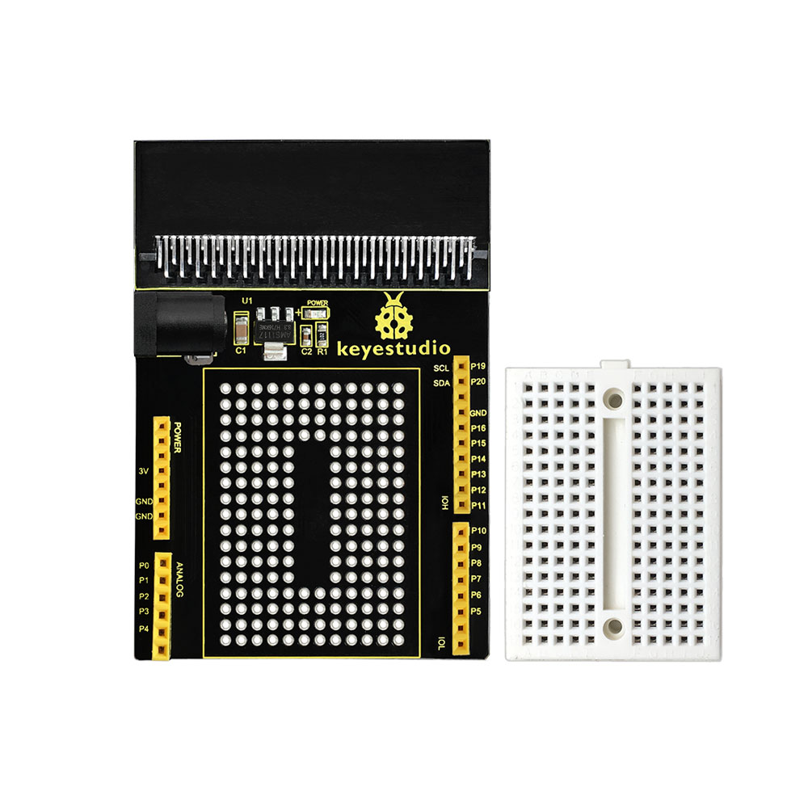
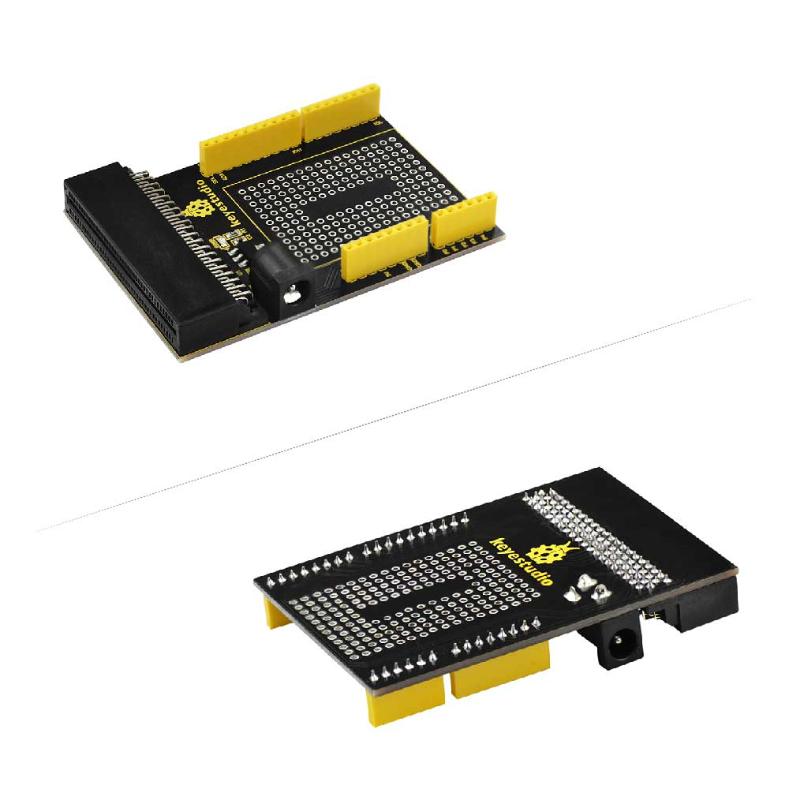
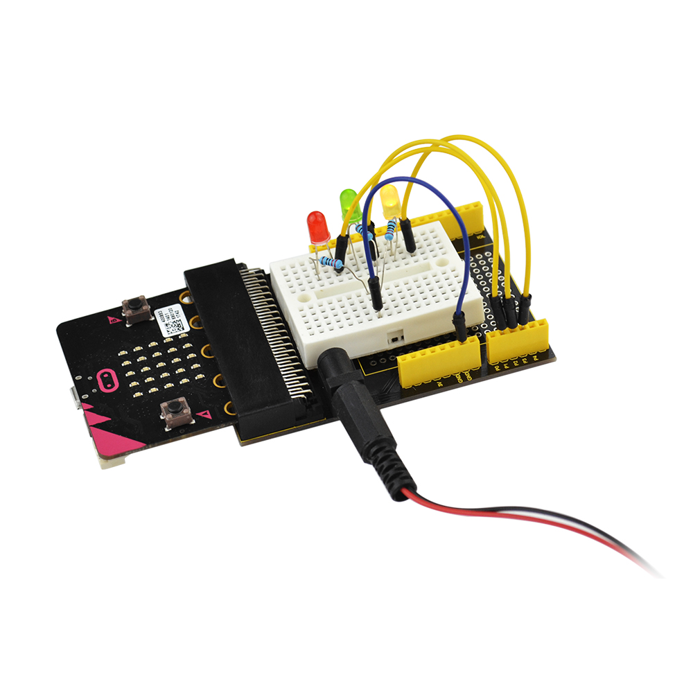

**Keyestudio Prototyping Breakout Board V1 with Small Breadboard for micro:bit**

****

**Introduction**

The BBC micro:bit is a powerful handheld, fully programmable, computer designed
by the BBC. It was designed to encourage children to get actively involved in
technical activities, like coding and electronics.

It features a 5x5 LED Matrix, two integrated push buttons, a compass,
Accelerometer, and Bluetooth.

It supports the PXT graphical programming interface developed by Microsoft and
can be used under Windows, MacOS, IOS, Android and many other operating systems
without additional download of the compiler.

Looking to do more with your BBC micro:bit? Unlock its potential with this
Prototyping breakout board for the BBC micro:bit!

On-board comes with AMS1117 chip, and you can power micro:bit via connecting
external jack DC 4.75-12V.

This breakout board has brought out all the pins on the edge of the BBC
micro:bit with female header.

Prototyping area is using double-sided PCB through-hole design. It allows you to
solder the electronic components on the breakout board, or you are able to
connect the external circuit using small breadboard.

Just need to place the small breadboard on prototyping area of breakout board
using double-sided adhesive.

Note that breadboard and breakout board are separated in packaging.

**Parameters**

-   Input Voltage: DC 4.75-12V

-   Breadboard: 170 point

-   Pin Spacing: 2.54mm

**Example Use**

