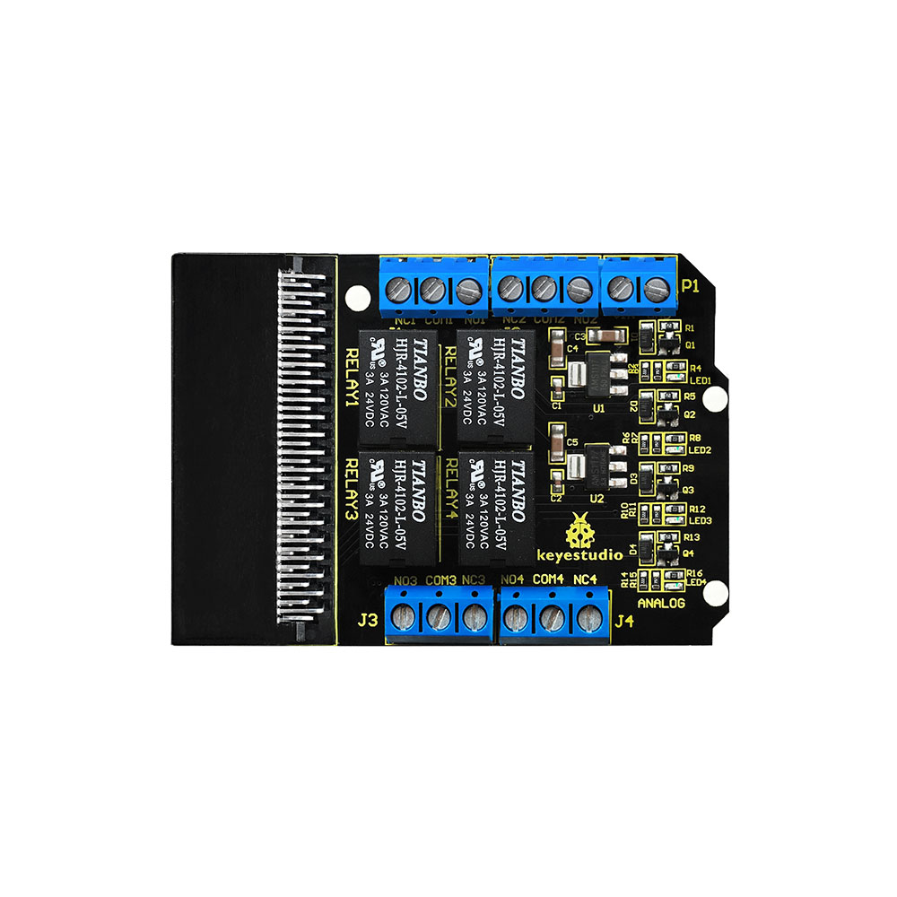
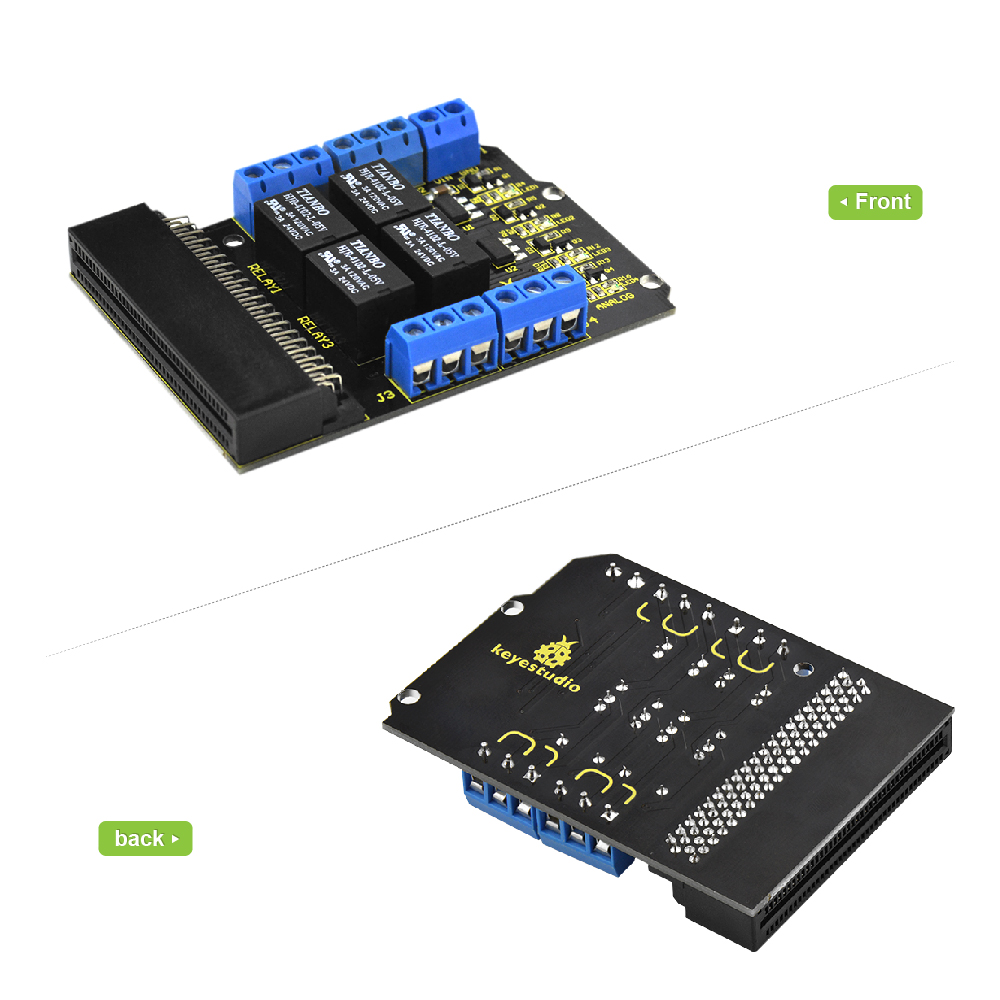
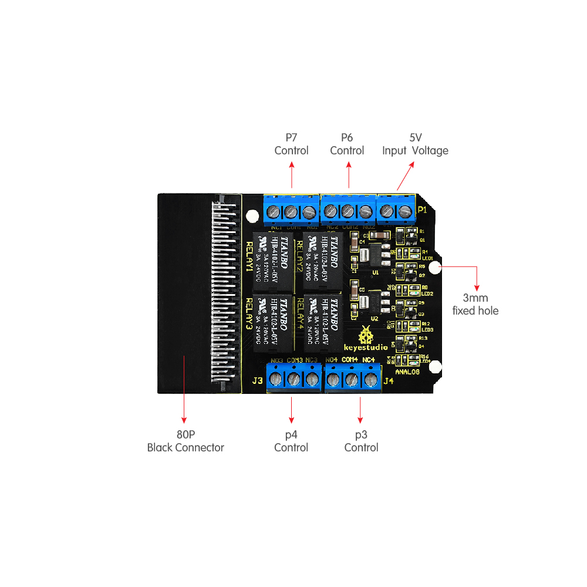
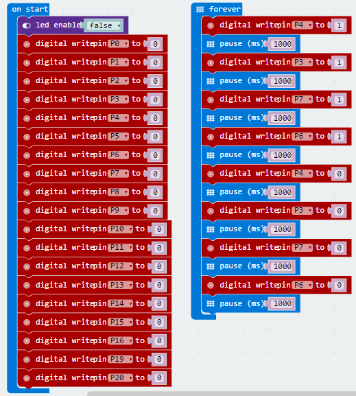
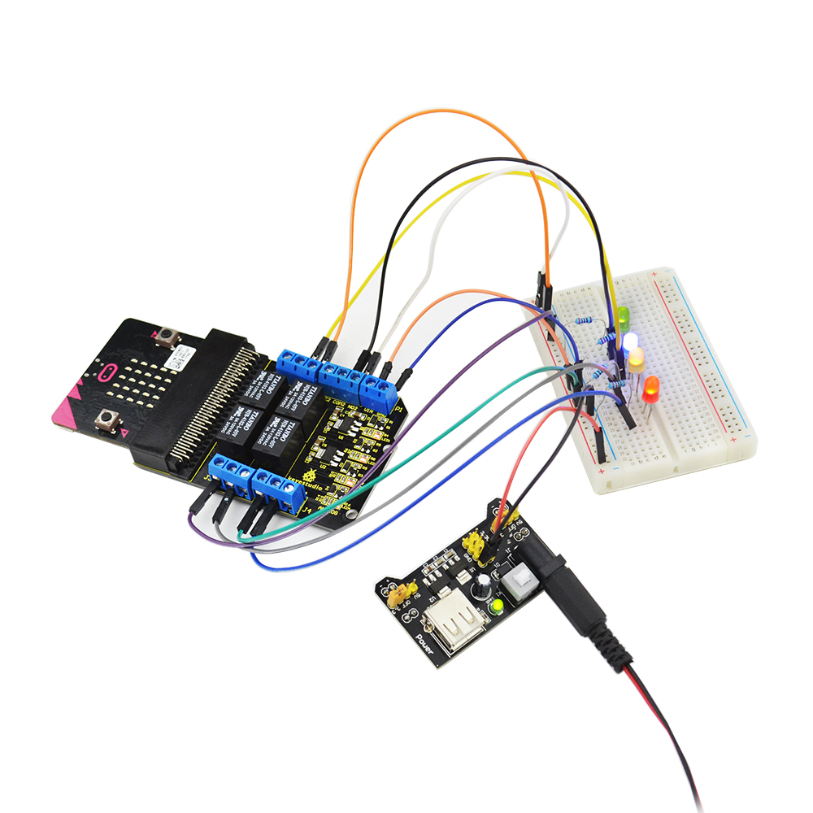

**Keyestudio Relay Breakout Board for micro:bit**

****

**Introduction**

The BBC micro:bit is a powerful handheld, fully programmable, computer designed
by the BBC. It was designed to encourage children to get actively involved in
technical activities, like coding and electronics.

It features a 5x5 LED Matrix, two integrated push buttons, a compass,
Accelerometer, and Bluetooth.

It supports the PXT graphical programming interface developed by Microsoft and
can be used under Windows, MacOS, IOS, Android and many other operating systems
without additional download of the compiler.

Keyestudio relay breakout board for micro:bit has integrated a 4-way 5V relay
module, fully compatible with micro:bit development board.

It can work only need to insert micro:bit into keyestudio relay shield, then
input DC5V voltage on the relay VIN/GND port, pretty simple and convenient.

The 4-way relay on the breakout board is active HIGH. Its control terminals are
respectively connected to P4, P3, P7 and P6 of the micro:bit development board.
You only need to control the high or low output level of P4, P3, P7 and P6 ,
thus control the 4 relay on/off.

**Parameters**

-   Input Voltage: DC 5V

-   Working Mode: active at HIGH level

-   Contact Capacity: AC120V/3A ; DC24V/3A

**PINOUTS Diagram**

**Testing Program**

**Testing Result**

Insert micro:bit development board into keyestudio relay breakout board;
powering up, you can see the 4-way relay is connected and then disconnected one
by one.

**Go Further**

You can connect the additional circuit to realize your project designs.

