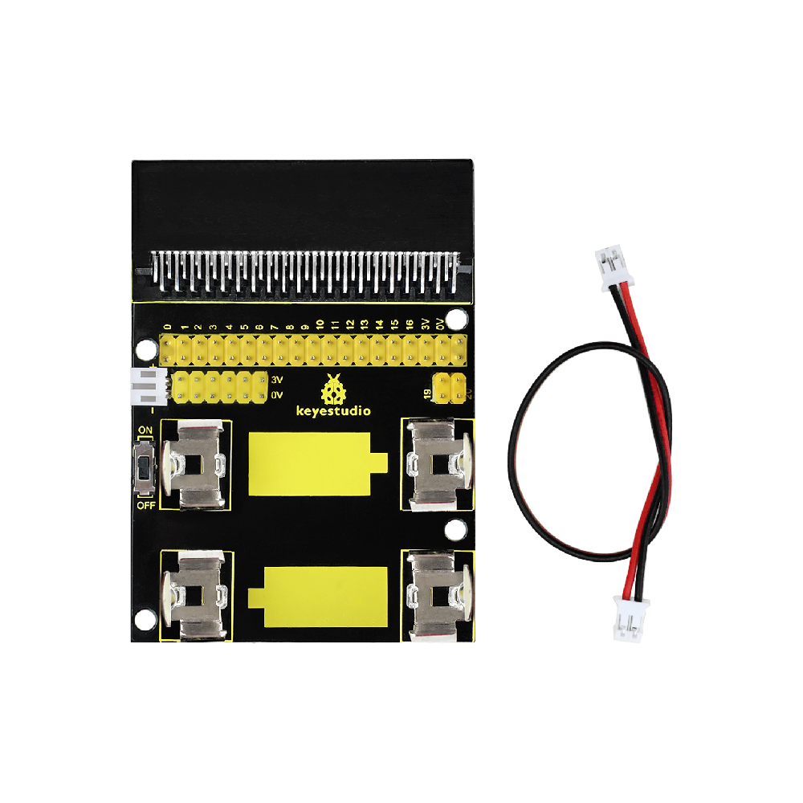
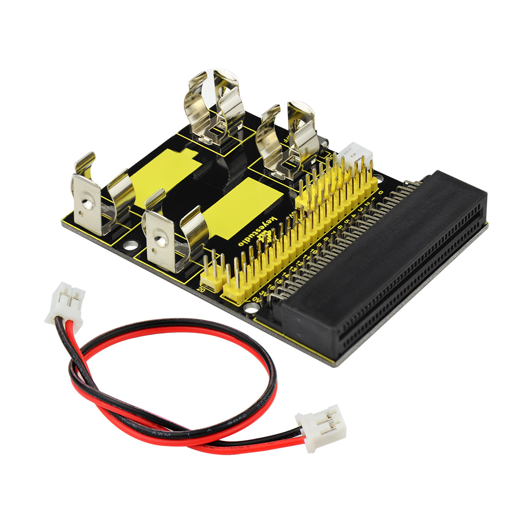
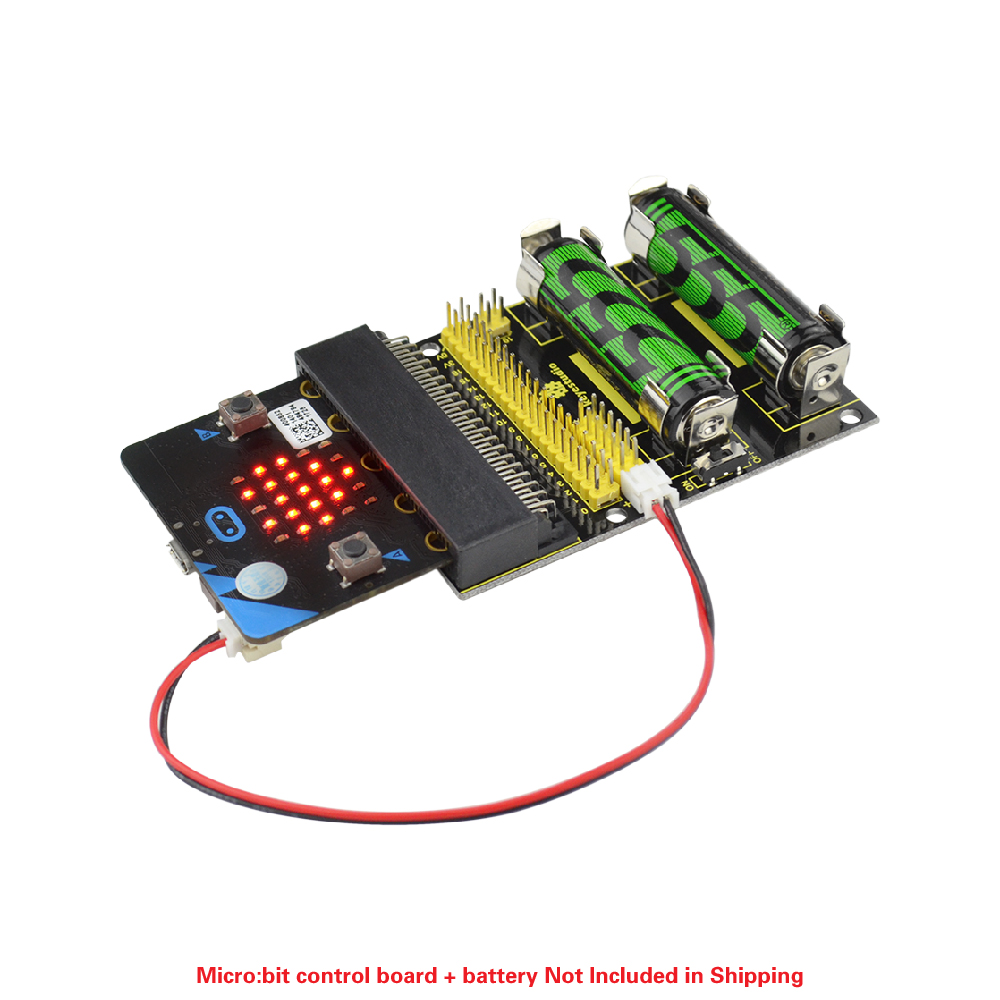

# **Keyestudio Power Supply Shield for micro:bit**

****

**Introduction**

The BBC micro:bit is a powerful handheld, fully programmable, computer designed
by the BBC. It was designed to encourage children to get actively involved in
technical activities, like coding and electronics.

It features a 5x5 LED Matrix, two integrated push buttons, a compass,
Accelerometer, and Bluetooth.

It supports the PXT graphical programming interface developed by Microsoft and
can be used under Windows, MacOS, IOS, Android and many other operating systems
without additional download of the compiler.

Looking to do more with your BBC micro:bit? Use this power supply breakout board
for the BBC micro:bit!

On-board comes with two interfaces, which can access to two-cell AA batteries,
each supply 1.5V. It also comes with a DIP switch for controlling the power
input.

In the experiment, you can connect this power supply board to micro:bit
development board using a double-headed JST-PH2.0MM-2P 24AWG red-black wire to
supply power.

At same time, to facilitate to links with other electrical components, shield
breaks out the signal end of micro:bit with pins in 2.54mm pitch. Every signal
end has two ports for your reference, moreover, there are 8 sets of power output
ends for external power.

Note:batteries are not included.

**Parameters**

-   PCB Size: 78mm\*58mm\*20mm

-   Battery Voltage: DC 1.5V

-   Input Voltage: DC 3V

-   Wire Length: 170mm

-   Pin pitch:2.54mm

****

**Example Use**

Send the code to micro:bit main board and then insert the micro:bit main board
into power supply shield. Connect well the batteries and wire. See the LED
matrix displaying the images.

****
