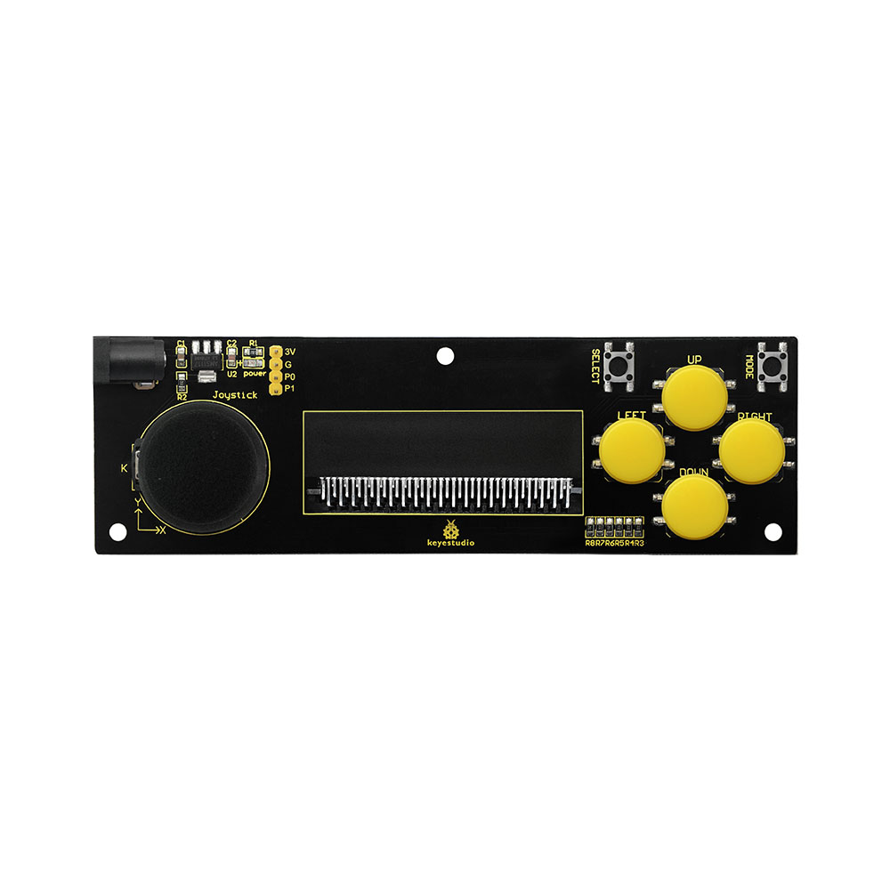
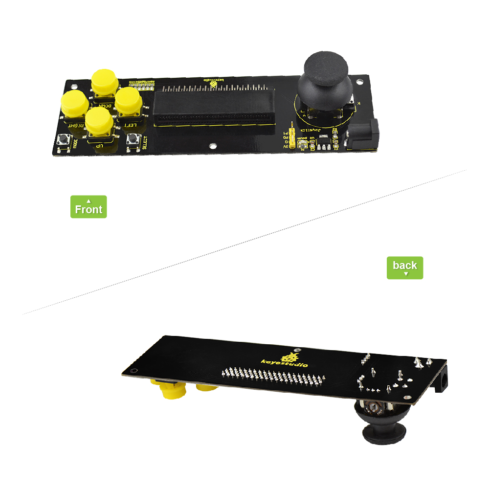
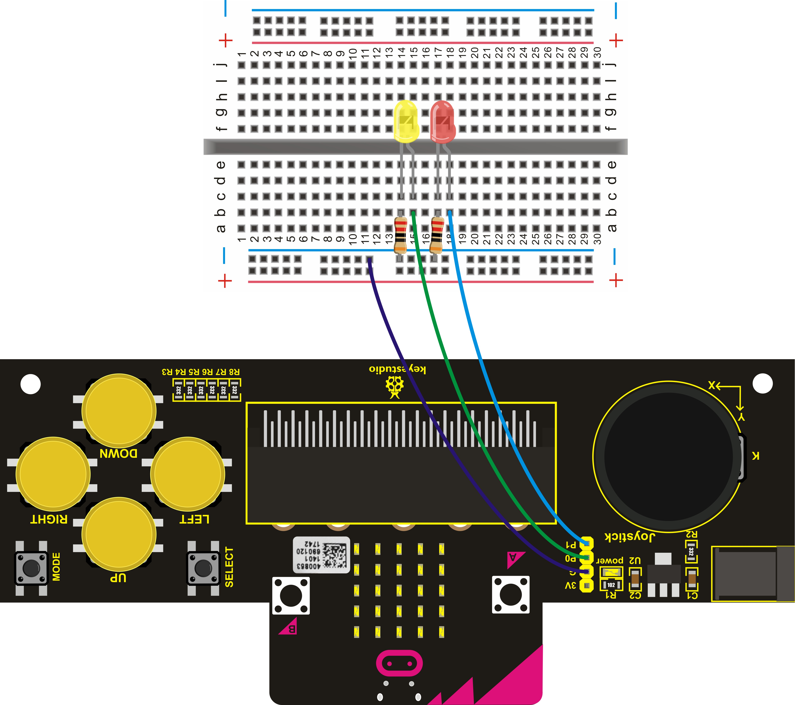
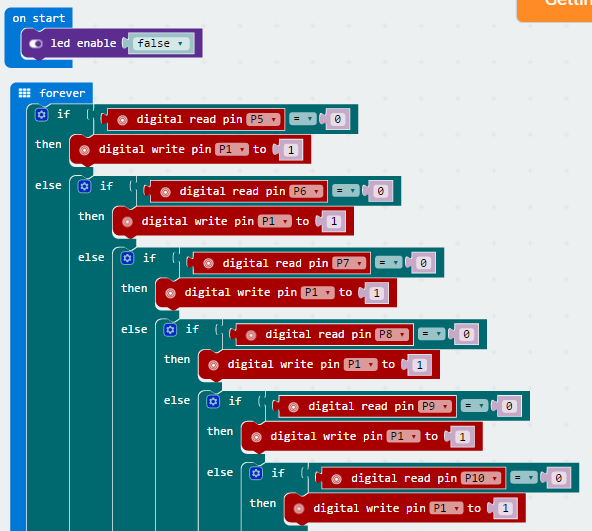
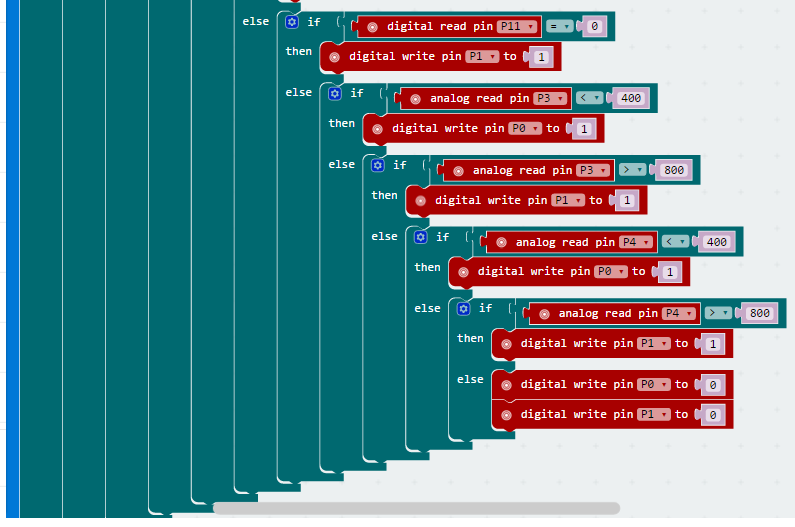
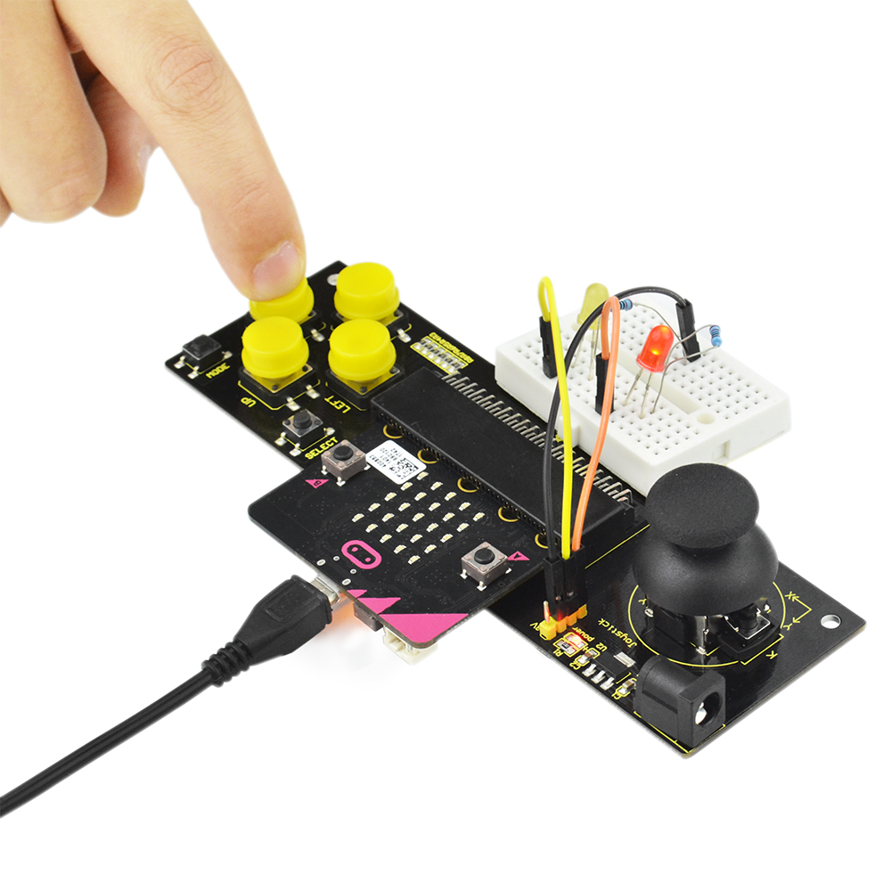
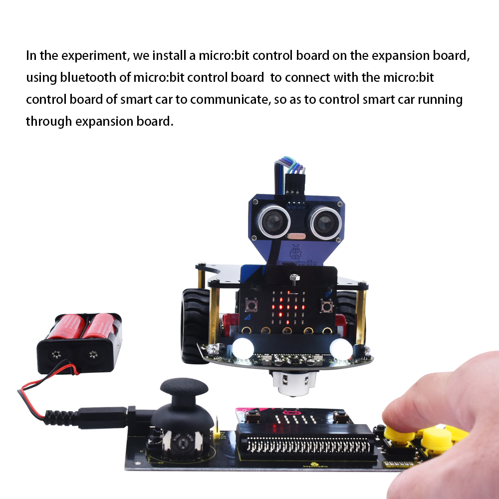
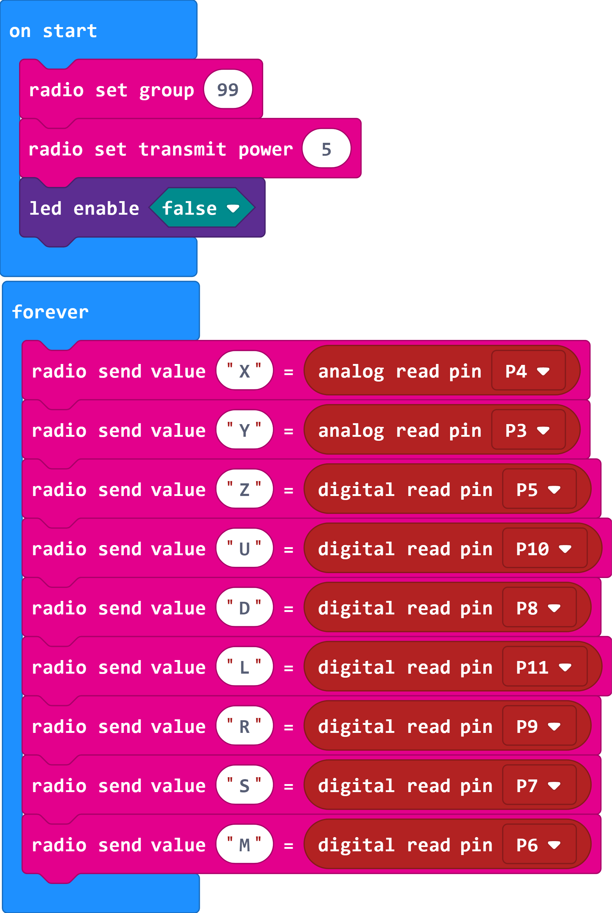
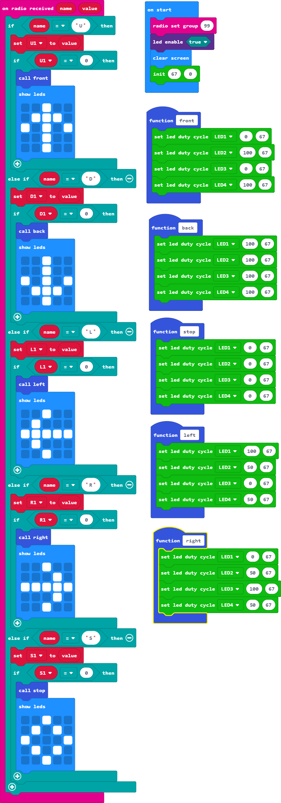

# **Keyestudio Joystick Breakout Board for micro:bit**

****

**Introduction**

The BBC micro:bit is a powerful handheld, fully programmable, computer designed
by the BBC. It was designed to encourage children to get actively involved in
technical activities, like coding and electronics.   
It features a 5x5 LED Matrix, two integrated push buttons, a compass,
Accelerometer, and Bluetooth.   
It supports the PXT graphical programming interface developed by Microsoft and
can be used under Windows, MacOS, IOS, Android and many other operating systems
without downloading the compiler.

Looking to do more with your BBC micro:bit? Unlock its potential with this
Joystick breakout board for the BBC micro:bit!

Keyestudio joystick breakout board for micro:bit comes with AMS1117 chip. You
can connect the external DC4.75-12V to power for micro:bit development board.

It can be used to simulate the mouse or keyboard. Connect the on-board pins
3V、G、P0、P1 to micro:bit main board to get analog serial port, connecting the
Bluetooth devices.

This breakout board also consists of 6 buttons and a joystick. Connect the
button and joystick to micro:bit pins.

Connect SELECT button to P7; MODE button to P6; UP button to P10; LEFT button to
P11; RIGHT button to P9; DOWN button to P8.

Connect joystick X axis to P4; Y axis to P3; Z axis to P5. You can control the
external devices by reading the interface states.

**Parameters**

-   Input Voltage：DC 4.75-12V

**Wiring Diagram**

****

**Test Program**

You can write the code below on micro:bit MakeCode editor

[https://makecode.microbit.org/\#editor](https://makecode.microbit.org/#editor)

Downloaded the code you wrote well, send it to your micro:bit main board.

**Test Result**

Insert the micro:bit development board into keyestudio joystick breakout board,
powering up, 2 LEDs will display as below:

1.  Do not operate both joystick and buttons, 2 LEDs are off.

2.  Press down any buttons ( including joystick Z axis button), red LED is on;
    release the button, LED will be off.

3.  Turn Joystick upward, red LED on; joystick downward, yellow LED on; joystick
    leftward, yellow LED on; joystick rightward, red LED on.

**Shield Experiment**

In the experiment, we can insert a micro:bit control board on the shield, upload
the corresponding test code, and set it as the Bluetooth host. We take a
micro:bit control board, connect to the external device, upload the
corresponding test code, set it as a Bluetooth slave. When both micro:bit
control boards are powered up, the Bluetooth of two micro:bit control boards
connect to the communication. We can control the external devices (such as LED
buzzers, etc.) connected to the Bluetooth slave via external devices connected
to the Bluetooth host (buttons on shield, joystick).  
Here, we use this shield connected to a micro:bit control board to control the
movement of a micro:bit smart car (KS0426). When using it, we only use the UP,
DOWN, LEFT, RIGHT and SELECT buttons on the shield to control the smart car
forward moving, backward moving, left turning, right turning and stopping. The
dot matrix of the control board on the smart car displays the current motion
status pattern.

**KS0426 Smart Car Resources：**

[**https://wiki.keyestudio.com/Ks0426_keyestudio_Micro:bit_Mini_Smart_Robot_Car_Kit_V2**](https://wiki.keyestudio.com/Ks0426_keyestudio_Micro:bit_Mini_Smart_Robot_Car_Kit_V2)

**Test Code Of Micro:bit Control Board Connected The Shield:**

**Test Code Of Micro：bit Control Board On KS0426 Smart Car:**

****

**Resource**

[https://fs.keyestudio.com/KS0296](https://fs.keyestudio.com/KS0298)
