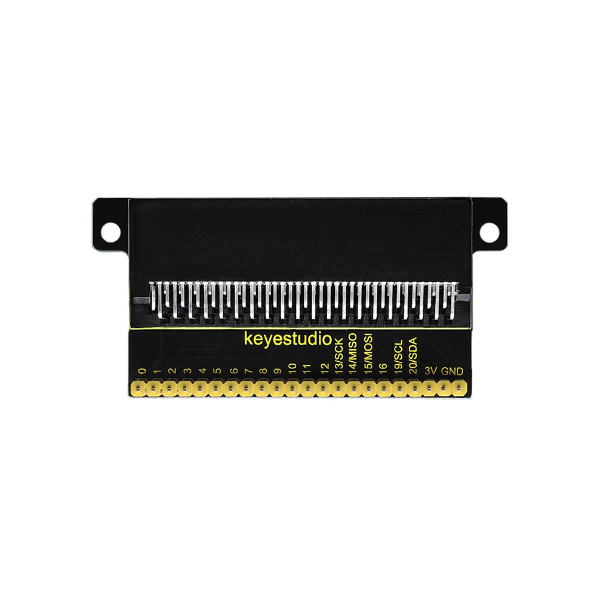
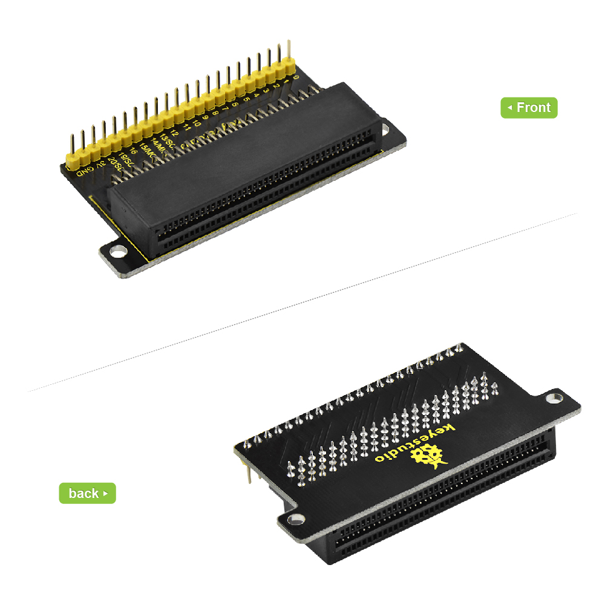
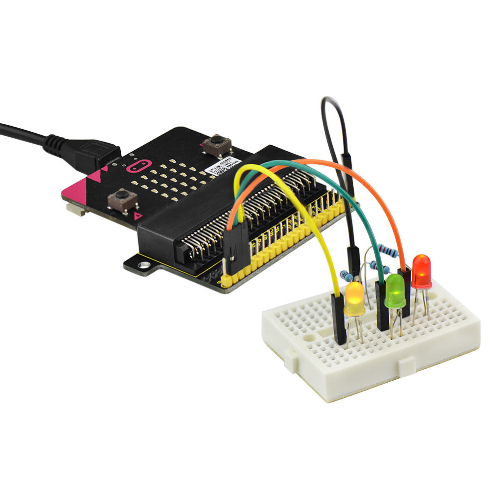

**Keyestudio Breakout Board Adapter for micro:bit**

****

**Introduction**

The BBC micro:bit is a powerful handheld, fully programmable, computer designed
by the BBC. It was designed to encourage children to get actively involved in
technical activities, like coding and electronics.

It features a 5x5 LED Matrix, two integrated push buttons, a compass,
Accelerometer, and Bluetooth.

It supports the PXT graphical programming interface developed by Microsoft and
can be used under Windows, MacOS, IOS, Android and many other operating systems
without downloading the compiler.

Looking to do more with your BBC micro:bit? Unlock its potential with this Edge
Connector Breakout Board Adapter for the BBC micro:bit.

This breakout board has been designed to offer an easy way to connect additional
circuits and hardware to the pins on the edge of the BBC micro:bit.

The BBC micro:bit pins are broken out to a row of pin headers. These provide an
easy way of connecting circuits using jumper wires.

**Parameters**

-   Input Voltage: DC 3V

-   Pin Pitch: 2.54mm

**Example Use**

To use the breakout board the BBC micro:bit should be inserted firmly into the
connector as shown below.

You can extend to connect some components using tiny breadboard to design your
own circuit.

