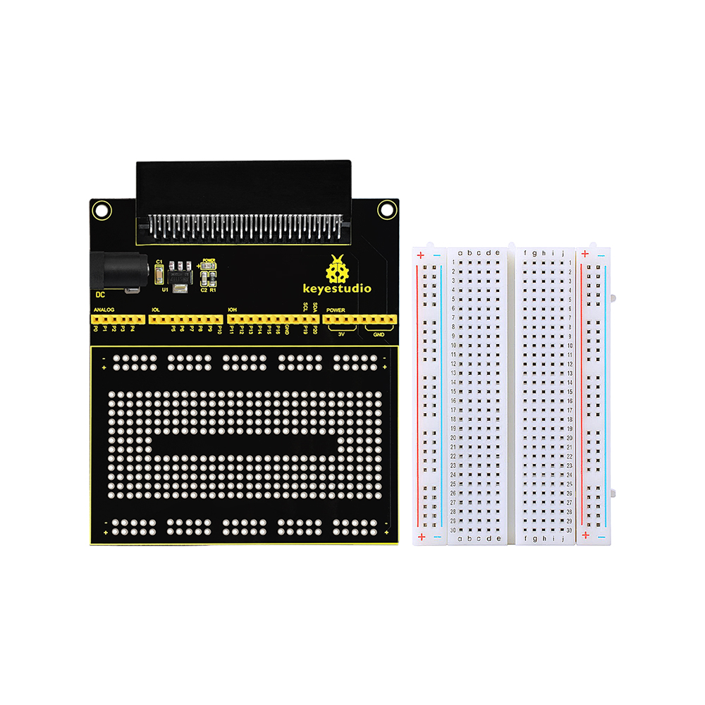
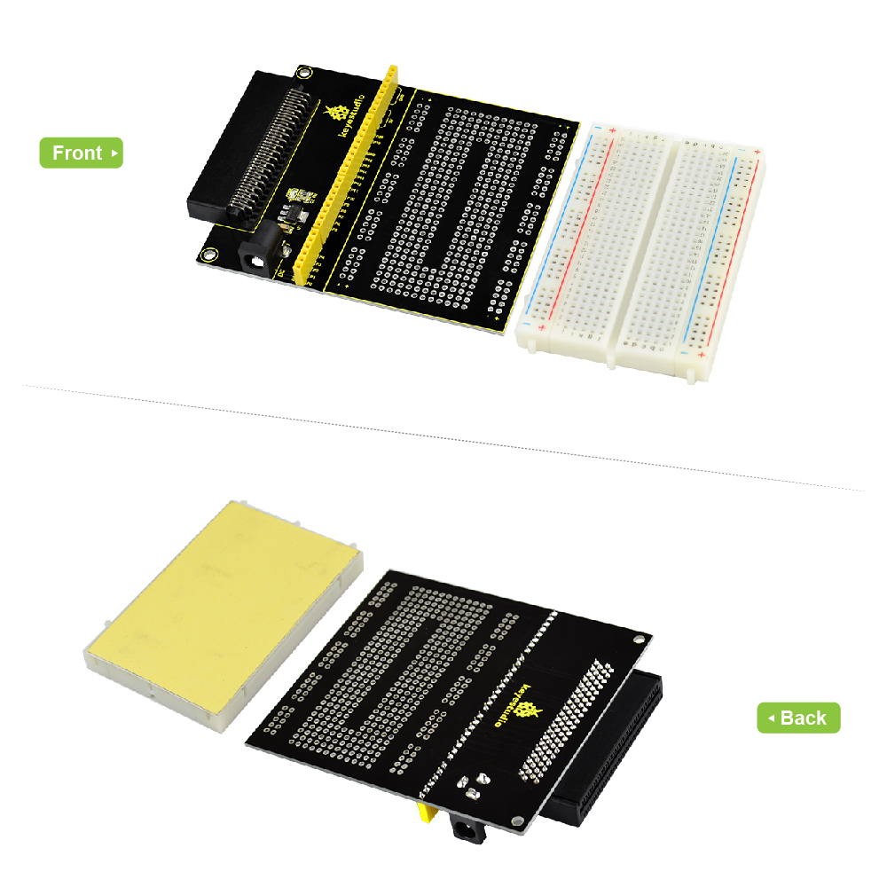
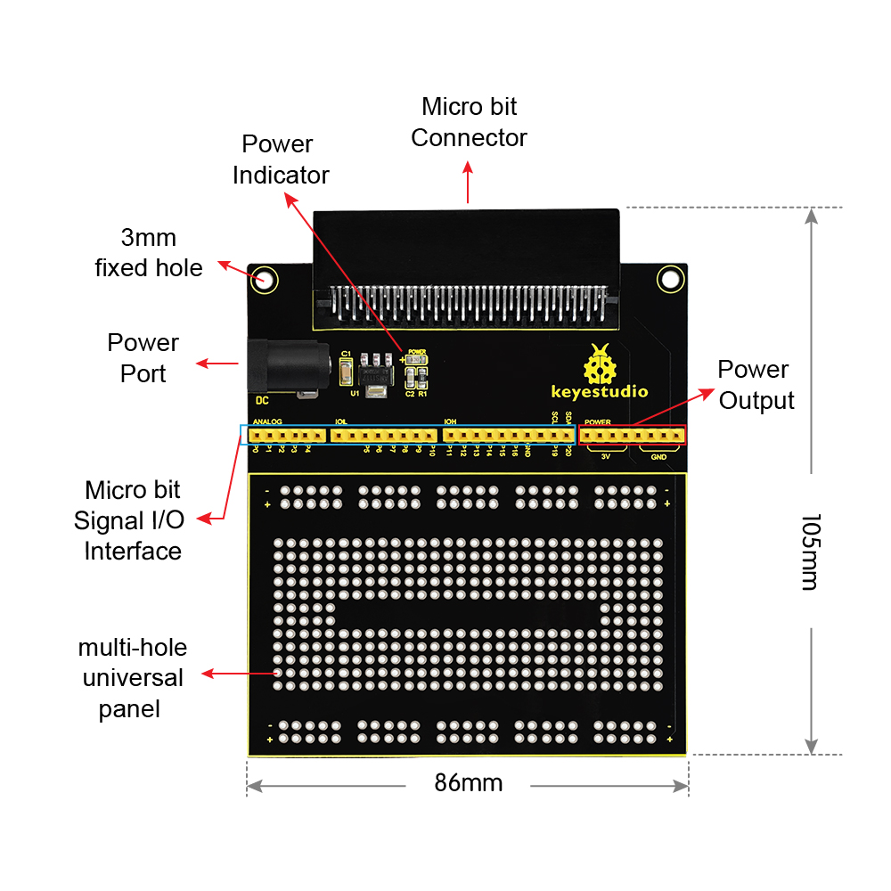
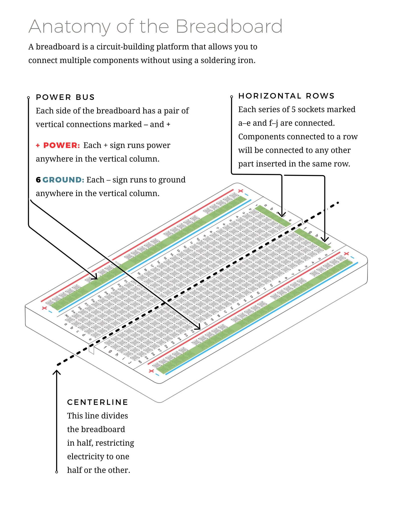
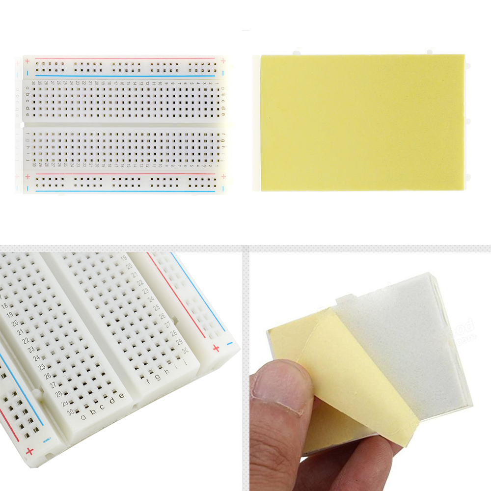
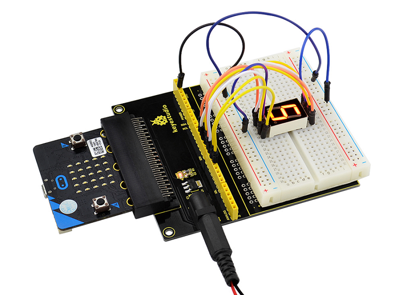
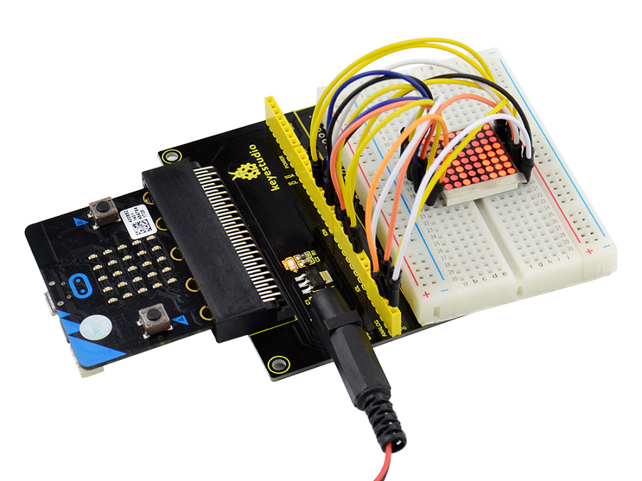
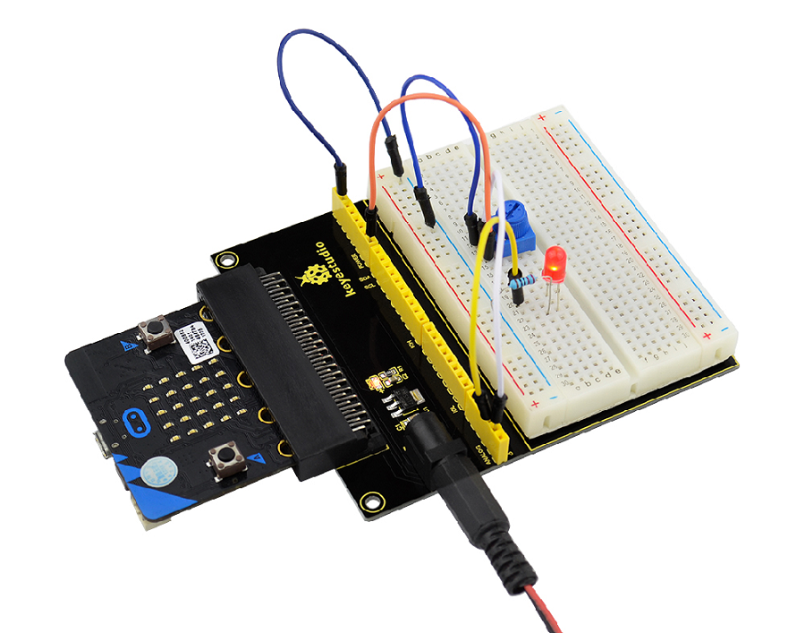

**Keyestudio Prototype Breakout Board V2 for micro:bit**

**With 400-point Breadboard**

****

**Description:**

Keyestudio prototype breakout board V2 is specially designed for micro:bit
motherboard. It breaks out all the pins of micro:bit in the form of female
headers, very convenient for the circuit building.

The breakout board has a number of circular weld holes and an external black
power jack.

The product also contains a [400-point tiny
breadboard](https://www.aliexpress.com/store/product/Freeshipping-WHITE-400-hole-Breadboard/1452162_32251843389.html?spm=2114.12010608.0.0.e6c4553aJrZGTe).

You can not only build the test circuit on the 400-point breadboard, easy to
modify, but also can weld the design circuit directly on the small universal
panel of prototying breakout board.

What’s more, a power module is integrated on the breakout board, which can
directly power for the micro:bit board and increase the load capability of
breakout board.

The whole design is very easy to use, a good choice for you to add circuit
prototype.

**Features:**

1.  Micro:bit compatible, plug and play;

2.  Accurate label and simple structure;

3.  Break out the female headers on the board, easy for wiring;

4.  Able to build your test circuit on the welding hole panel;

5.  Integrated a power module on the board, convenient for powering micro:bit;

6.  With delicate breadboard 400-point, removable and easy to stick.

**Parameters:**

-   Power Input：5\~9V

**Layout:**

**400-point Solderless Breadboard:**

This is a [400 tie-point white solderless
breadboard](http://wiki.keyestudio.com/index.php/KS0331_400_Tie-Points_Solderless_Breadboard_3PCS).
This breadboard has a self-adhesive on the back. It has 2 power buses, 10
columns, and 30 rows - a total of 400 tie in points.

**Example Picture:**

Insert the micro:bit main board into the prototyping breakout board firmly.
Connect the external circuits on the small breadboard to design your amazing
projects.

