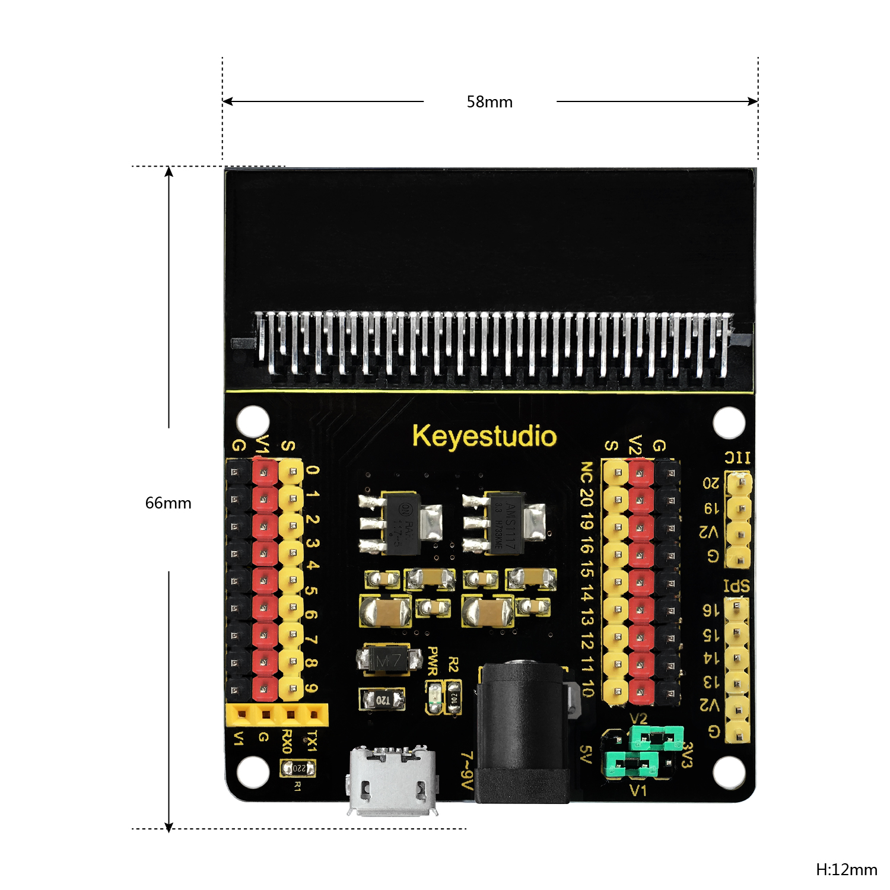
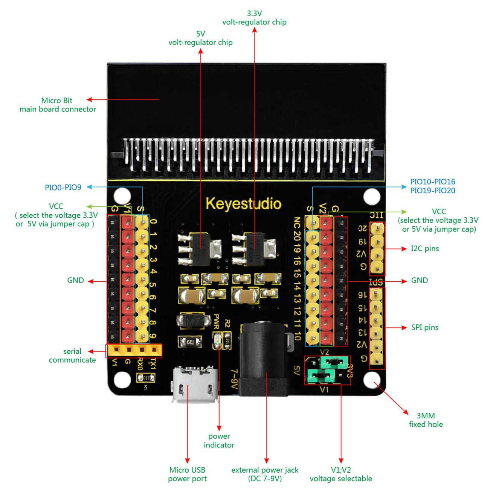
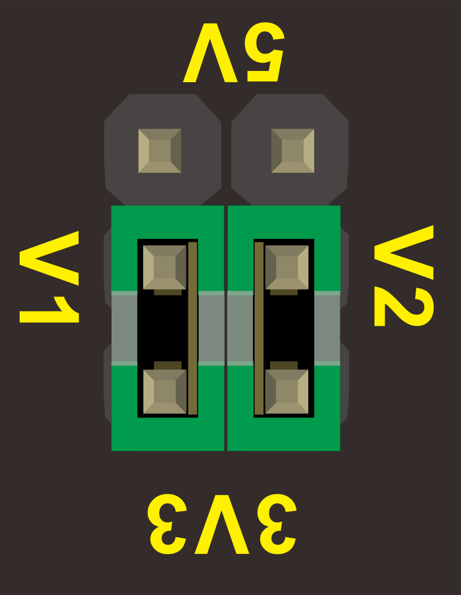
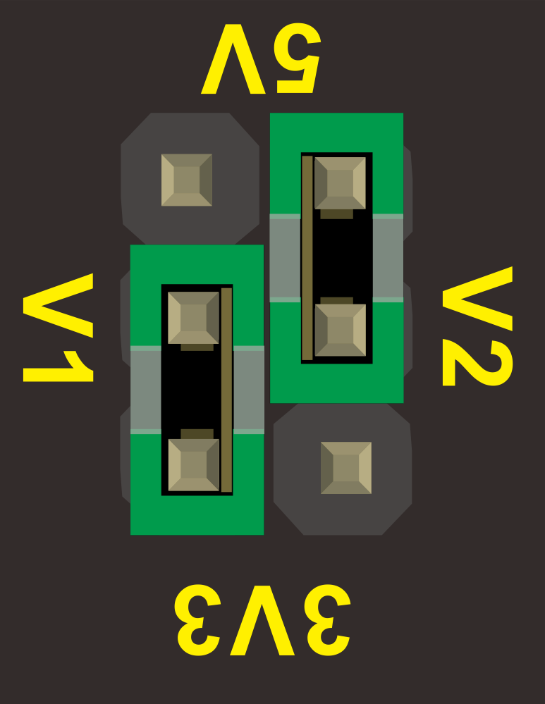
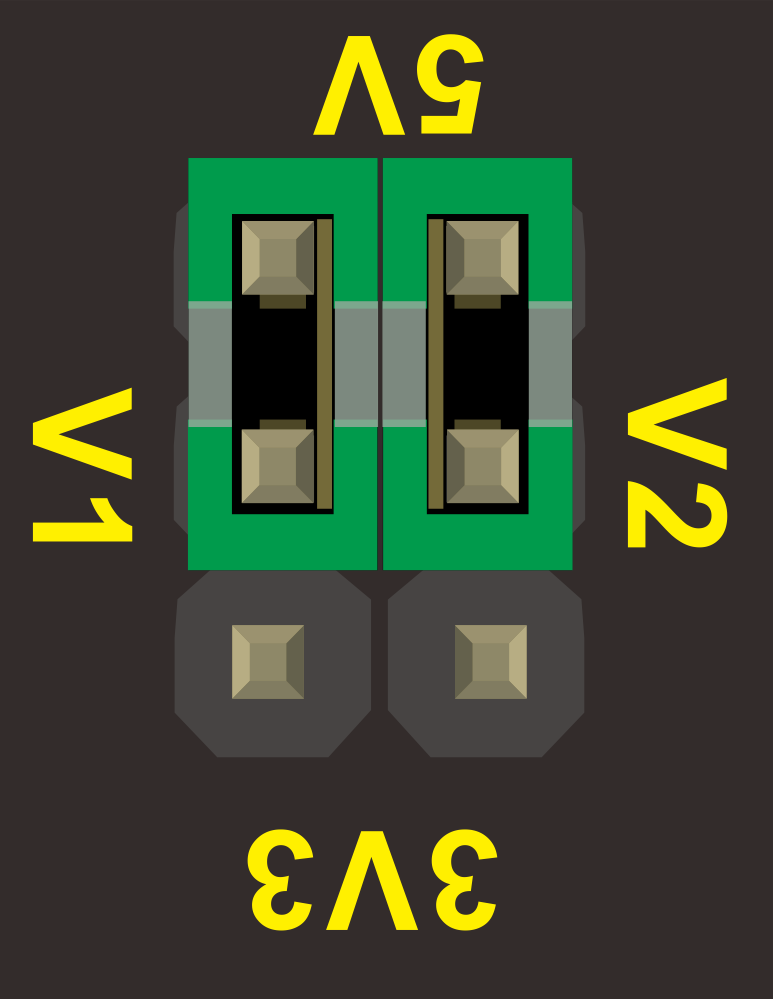
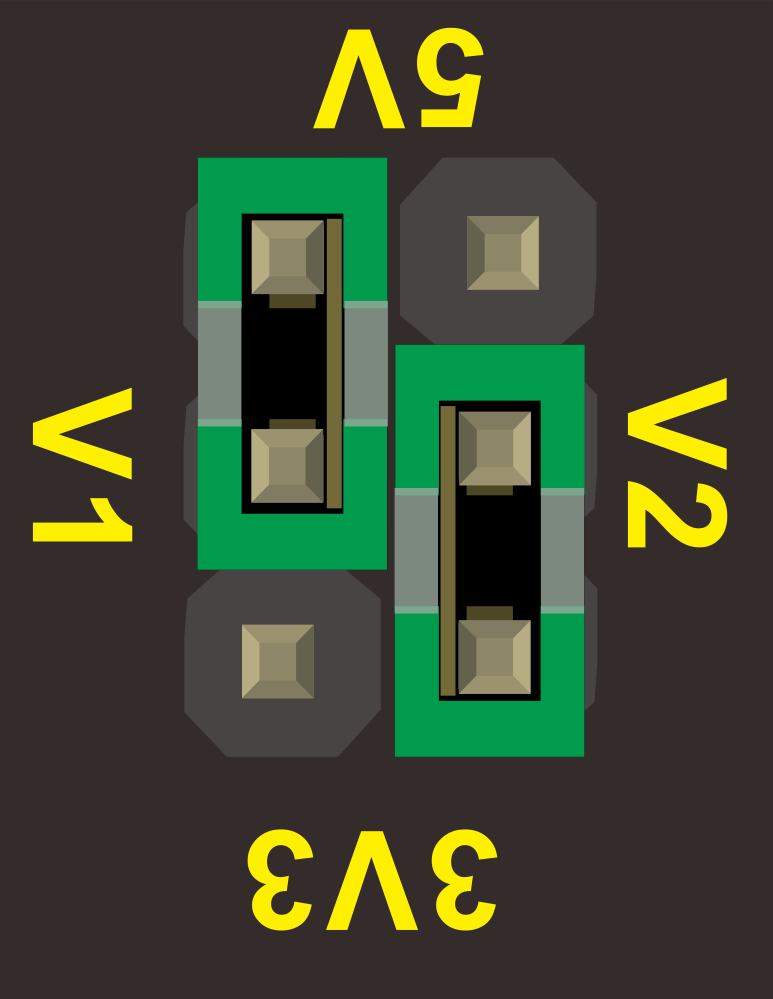
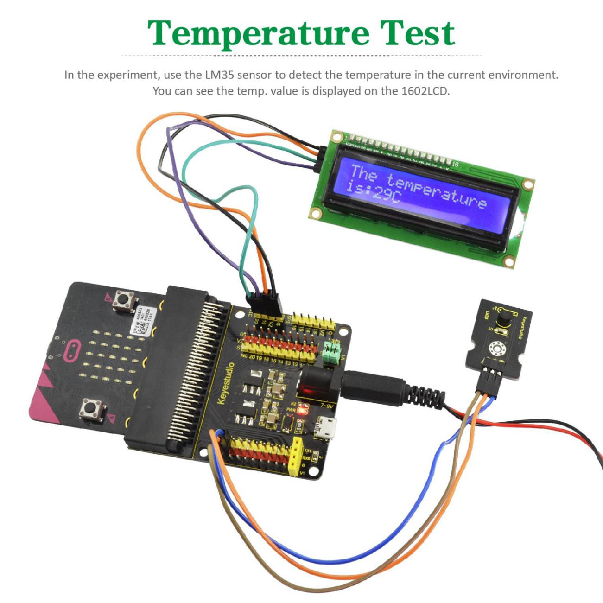

**Keyestudio Sensor Shield V2 for BBC micro:bit**

**Description:**

In the educational market, micro:bit control boards are becoming more and more
popular. However, a single micro:bit control board is not easy to test with
other sensor modules. We particularly design this keyestudio sensor expansion
board V2 for micro:bit.

The sensor shield V2 breaks out all the PIO ports on the micro:bit control board
into 3PIN interface (GND, VCC, Signal), very easy to connect the micro:bit
control board and other sensor modules.

Moreover, it also extends some commonly-used serial communication interfaces
into pin or female headers with 2.54mm pin pitch, such as I2C and SPI
communication pins. So that this shield will allow communication between
micro:bit control board and other communication devices.

You can power the micro:bit board through a black DC jack (DC 7-9V) or a mciro
USB port (DC 5V) on the shield.

When power the sensor, you could select the supply voltage 3.3V or 5V via jumper
cap V1 and V2.

**Special note:   
**when connect external sensor module to the shield for working,the operating
current of AMS1117-3.3V and NCP1117ST50T3G chip is too large, so it is easy to
get hot. Pay special attention to avoid touching the two chips and causing
burns.

**Controller Compatible:**

-   micro:bit control board

**Technical Details:**

-   Power input: black DC jack (DC 7-9V) or micro USB port (DC 5V)

-   Voltage output: select 3.3V or 5V via jumper cap V1/V2

-   Comes with a power indicator

-   Extends the PIO of micro:bit into 3PIN interface

-   Serial communication pin

-   I2C communication pin

-   SPI communication pin

-   Dimensions: 65mm x58mm x12mm

-   Weight: 31g

**PINOUT Diagram:**

****

| **Picture**                                             | **V1** Interface voltage**/V** | **V2** Interface voltage**/V** |
|---------------------------------------------------------|--------------------------------|--------------------------------|
|  | 3.3                            | 3.3                            |
|  | 3.3                            | 5                              |
|  | 5                              | 5                              |
|  | 5                              | 3.3                            |

**Example Use:**

Send the code to your micro:bit board, and insert it into the sensor shield.
Then set the V1 and V2 to 5V output, power it via DC jack (DC7-9V). Connect the
LM35 sensor and 12C 1602 LCD to the sensor shield using jumper wires. Finally
display the current temperature value on the LCD. You could refer to an example
picture below.

