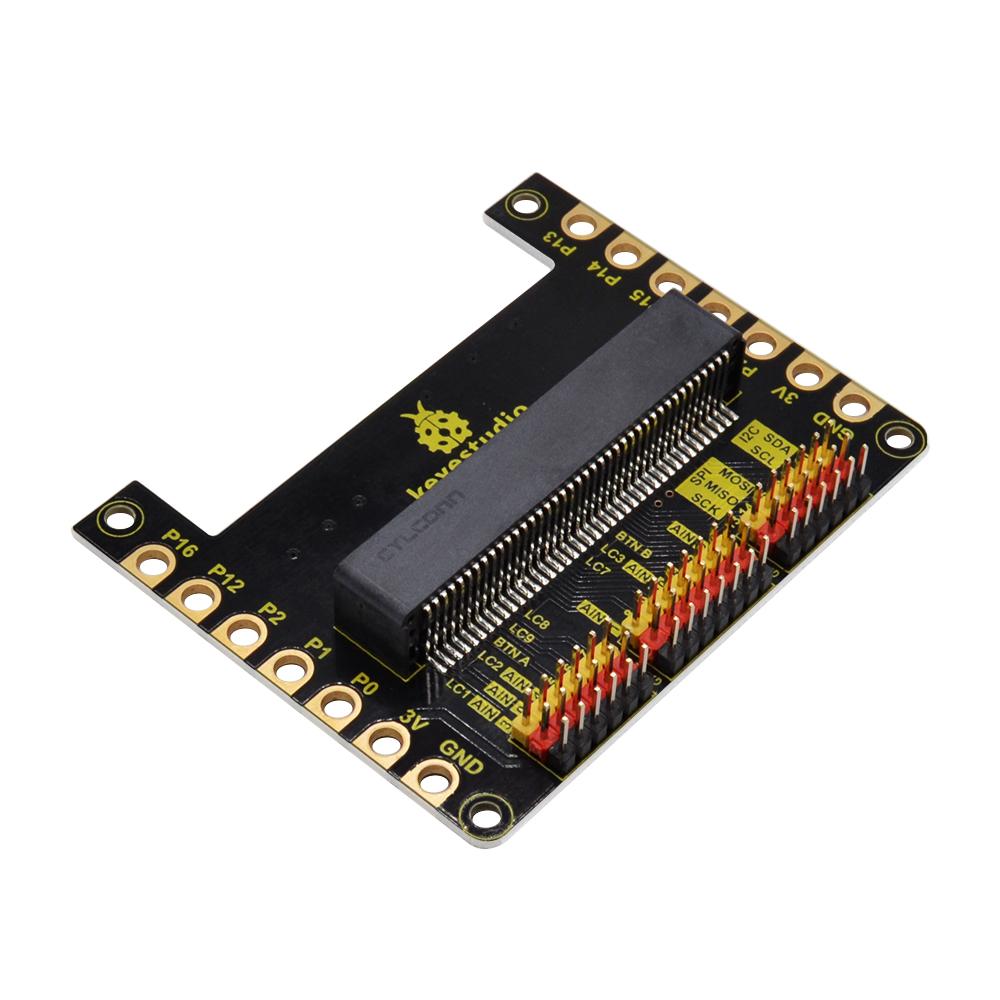
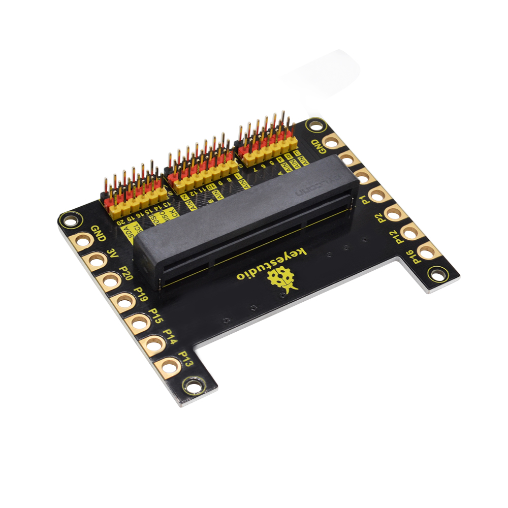

# **keyestudio 3V Sensor Shield For BBC micro:bit**

**(Black and Eco-friendly)**

****

**Overview**

The [BBC micro:bit](http://microbit.org/guide/features/) is a powerful handheld,
fully programmable, computer designed by the BBC. It was designed to encourage
children to get actively involved in technical activities, like coding and
electronics.

It features a 5x5 LED Matrix, two integrated push buttons, a compass,
Accelerometer, and Bluetooth. It supports the PXT graphical programming
interface developed by Microsoft and can be used under Windows, MacOS, IOS,
Android and many other operating systems without downloading additional
compiler.

If you want to connect a bunch of sensor modules to the micro:bit main board,
try use our keyestudio new designed sensor shield for micro:bit.

To make connection more direct, the sensor shield has brought out all the IO
pins on the edge of micro:bit main board to 3Pin interface. These provide an
easy way of connecting circuits using jumper wires. Label G means GND; V is VCC
(3.0-3V); S is Signal pin; corresponds to IO pins of micro:bit main board.

You can connect the golden rings on the sensor shield to other sensors or
modules using Alligator clip line. Or connect the sensors/modules to the pin
headers on the sensor shield using jumper wires.

There are 3 kinds of power supply methods for the sensor shield and micro:bit
main board.

1.  Direct connect the battery case to micro:bit main board for power supply;

2.  Connect the golden rings 3V GND with alligator clip lines for power supply;

3.  Connect random group of V G pin headers with jumper wire for power supply.

The sensor shield comes with 4 fixed holes at the edge, easy to mount on any
other devices.

**Specification**

-   Operating voltage: DC3.0-3.3V

-   Pin Pitch: 2.54mm

-   Dimensions: 76mm\*63mm\*12mm

-   Weight:22.8g

