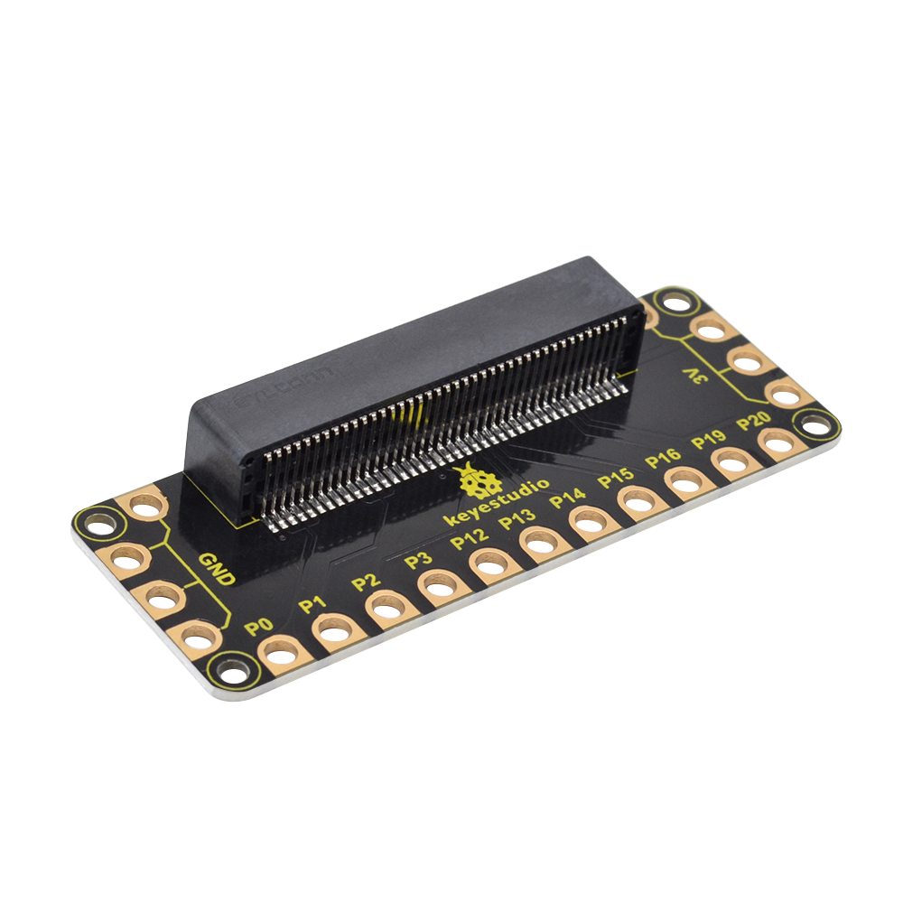
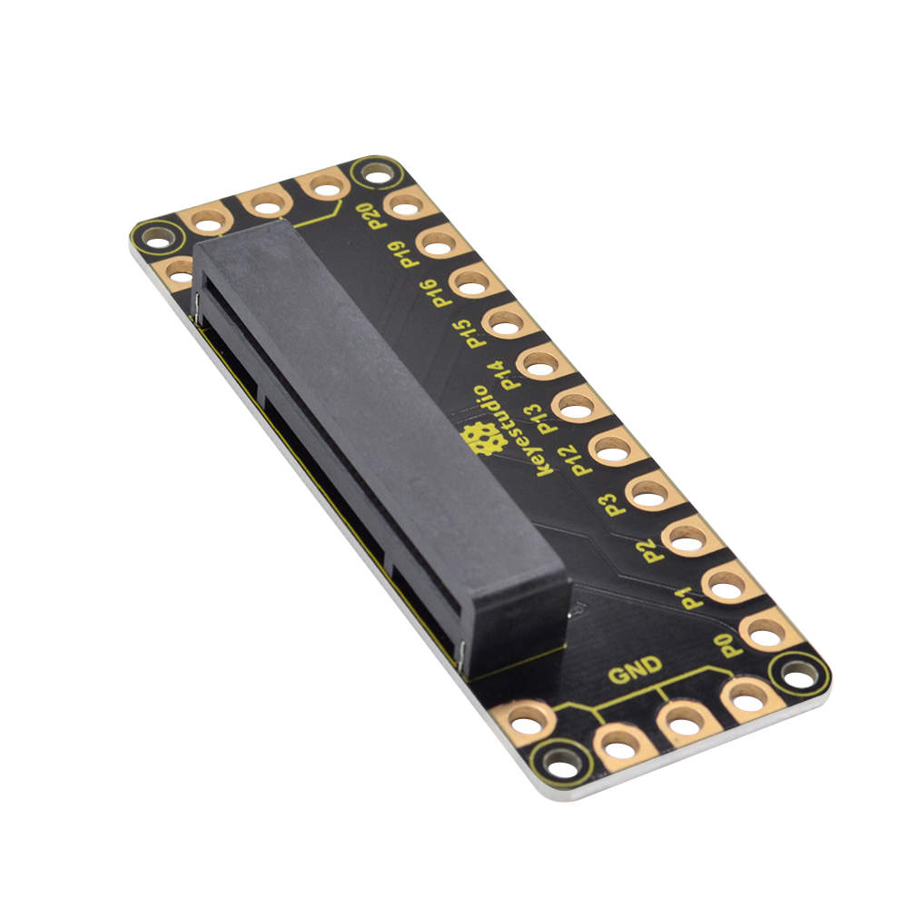
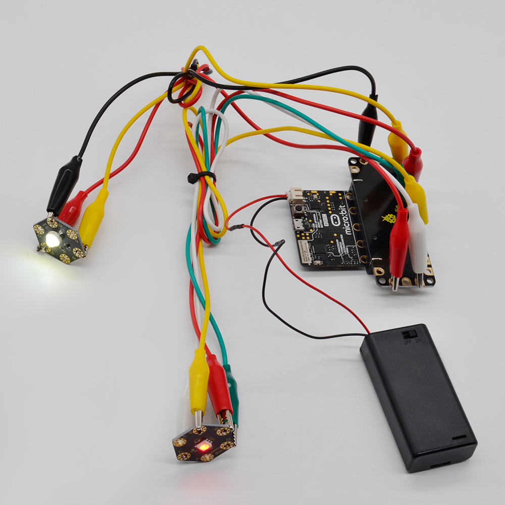

**keyestudio Edge Connector IO Breakout Board For BBC micro:bit**

**(Black and Eco-friendly)**

# 

**Overview**

The [BBC micro:bit](http://microbit.org/guide/features/) is a powerful handheld,
fully programmable, computer designed by the BBC. It was designed to encourage
children to get actively involved in technical activities, like coding and
electronics.

It features a 5x5 LED Matrix, two integrated push buttons, a compass,
Accelerometer, and Bluetooth. It supports the PXT graphical programming
interface developed by Microsoft and can be used under Windows, MacOS, iOS,
Android and many other operating systems without downloading additional
compiler.

It's what you've been waiting for, the keyestudio Edge Connector IO Breakout
Board For BBC micro:bit.

Want to connect a bunch of sensors and modules to micro:bit development board?
Try this keyestudio Edge Connector IO Breakout Board.

This breakout board has been designed to offer an easy way to connect additional
circuits and hardware to the edge connector on the BBC micro:bit. It provides an
easy way of connecting circuits using Alligator clip lines.

This edge connector offers access to a number of the BBC micro:bit processor
pins, such as power IO (input/output) interface, connection pins
P0、P1、P2、P3、P12、P13、P14、P15、P16、P19、P20 .

There are 2 kinds of power supply for the breakout board and micro:bit main
board.

1.  Direct to connect the battery case carried with batteries to micro:bit main
    board for powering;

2.  Connect the golden rings 3V GND with alligator clip lines for power supply;

The breakout board also comes with 4 fixed holes at the edge, easy to mount on
any other devices.

**Specification**

-   Operating voltage: DC3.0-3.3V

-   Dimensions: 89mm\*33mm\*12mm

-   Weight:14.8g

**Example Use**

Insert the micro:bit main board firmly into the breakout board, and connect some
micro:bit modules using Alligator clip lines to complete the circuit project. As
shown below. Great! image it and try to build your own creative circuit
projects.

****
