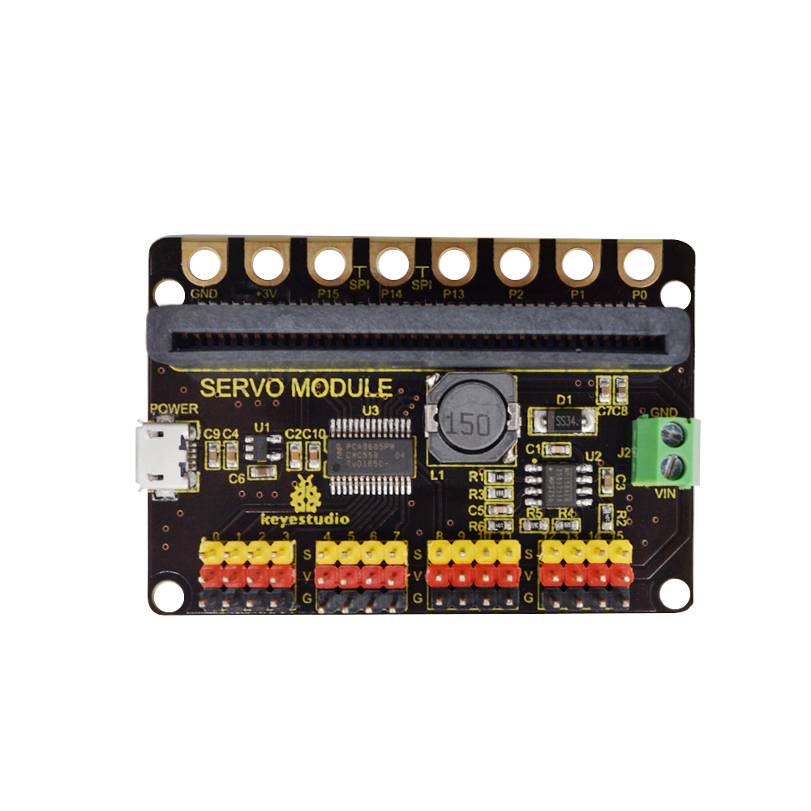
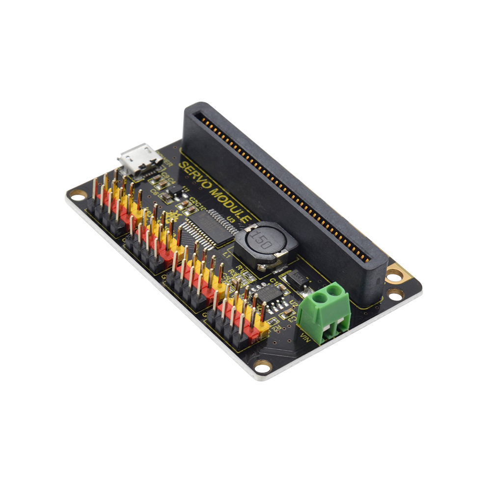
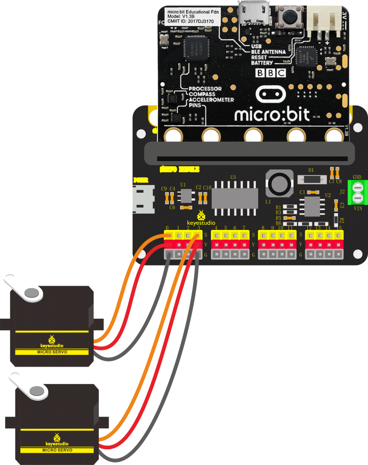
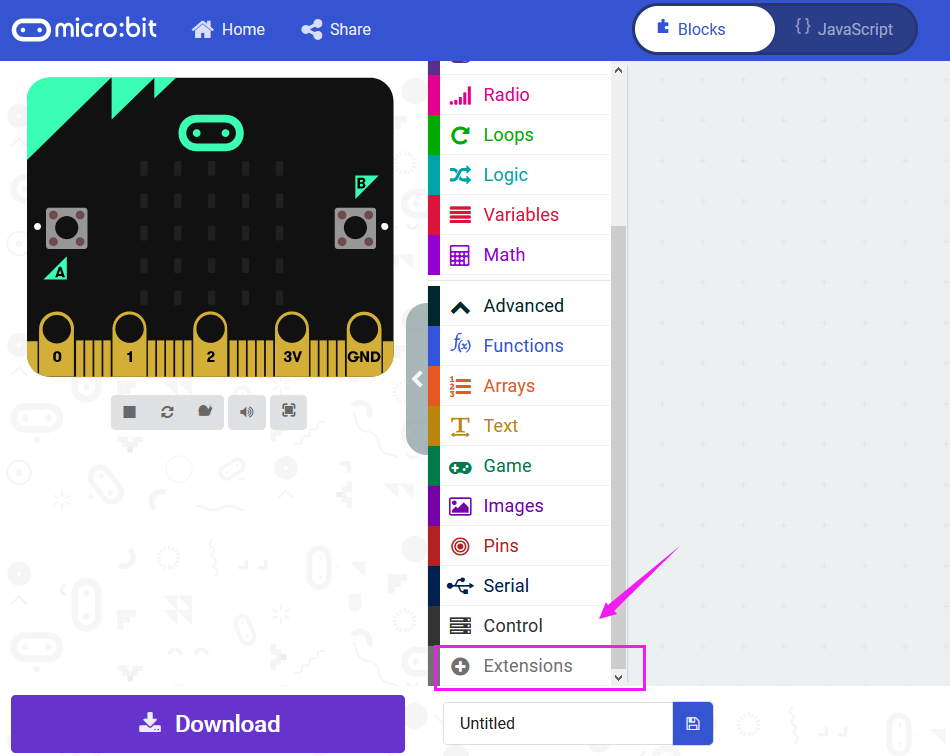
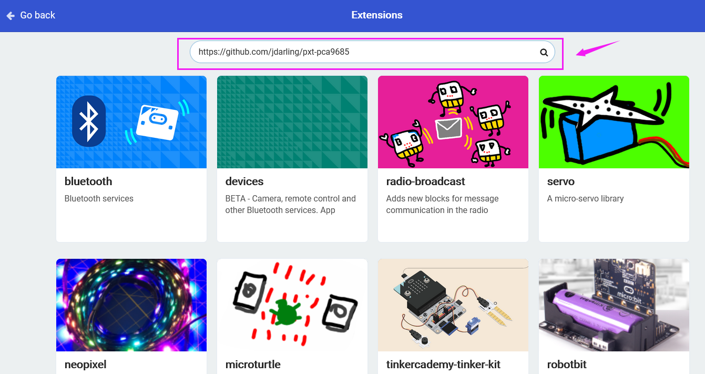
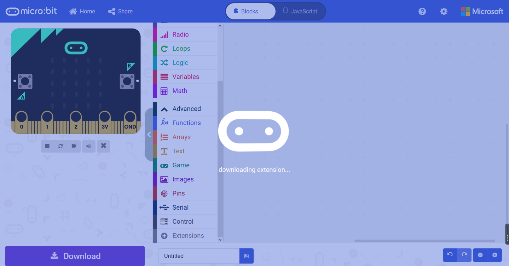
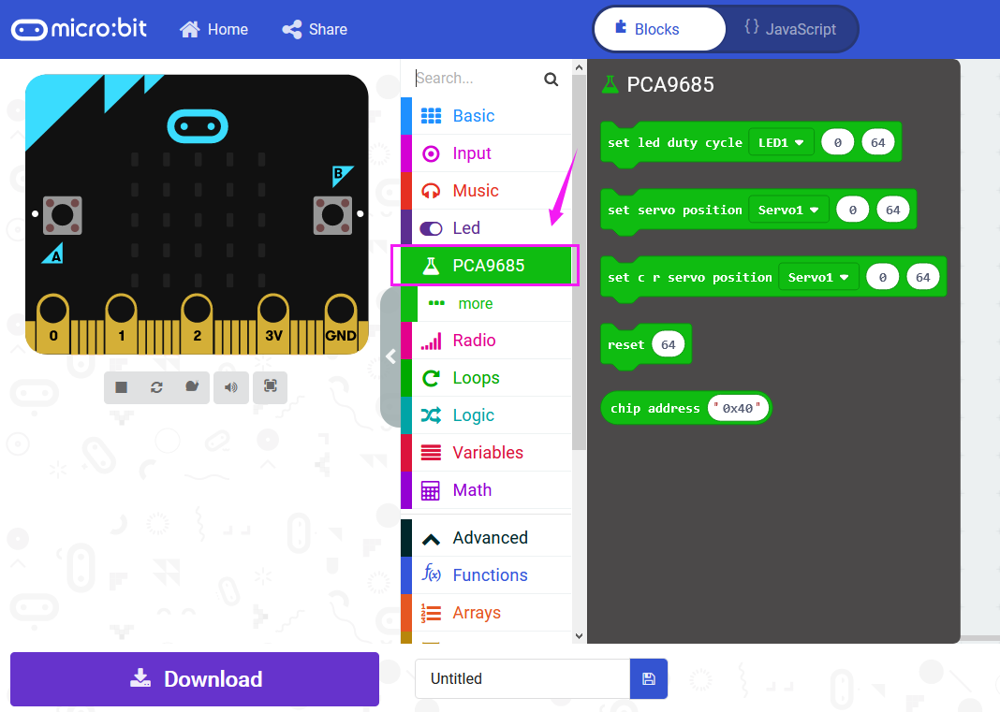
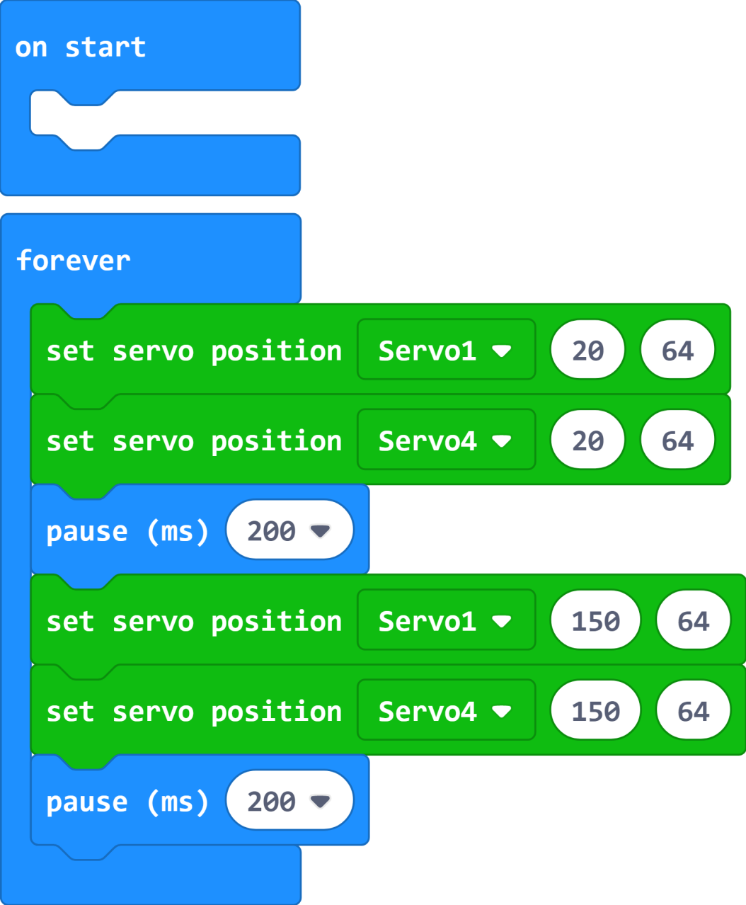

# **Keyestudio 16-channel SERVO Shield for Micro:bit**

# Overview

Have you tried driving a bunch of servo motors by a micro:bit main board but
failed? Micro:bit main board outputs the voltage DC3.3V, but servo motors
generally need driving with DC5V; the small driving current of a micro:bit
board, plus few IO ports, hardly drives a bunch of servo motors.

It's what you've been waiting for－keyestudio 16-channel SERVO Shield. It mainly
integrates a PCA9685PW chip which communicates with a micro:bit board through
I2C.
It also has 16 IO pins for steering 16 Servo motors. Meanwhile, for easy wiring,
we extend the control pin of each channel to **G V S** interface － 3pin header
with a pitch of 2.54 mm. The voltage of V pin on the Servo shield is 5V.

The servo shield can be supplied with power either from the micro USB connector
(DC5V input), or 2 green terminal blocks (DC 7-12V input).

Besides, the Servo shield also comes with 8 golden edge connectors. It allows an
easy way to connect additional circuits and sensors/modules hardware to the edge
connector on the BBC micro:bit or 3.3V output pin.

**Special note:**

Generally, the no-load current of the servo is about 220mA, and the maximum
current that the Micro USB can withstand is 2A.

If use the Micro USB interface to power, we can't drive 16 servos at the same
time.

# Technical Details

-   I2C input, controlling 16-channel PWM output; control 16 Servos

-   Control chip: PCA9685PW

-   Micro USB port: DC 5V

-   Terminal blocks: DC 7-12V

-   Frequency: 40-1000Hz

-   Dimensions: 63mm\*43mm\*12mm

-   Weight: 18.6g

# Hookup Guide

# Test Code

Before create the test code, need to add the library package first.

Go to the Microsoft MakeCode Editor
[https://makecode.microbit.org/\#editor](https://makecode.microbit.org/#editor)

Click on the **Extensions**:

Then enter the link <https://github.com/jdarling/pxt-pca9685> and search.

Click the **pca9685** to add the library extension

Extension added successfully, you can see the corresponding project on the
blocks bar.

**Code:**

# Test Result

Done wiring, send the test code to micro:bit main board. Supply the power by
micro USB port or green terminal blocks, Servo motors will rotate back and forth
between 20°and 150°

Resource

[https://fs.keyestudio.com/KS043](https://fs.keyestudio.com/KS0445)8
