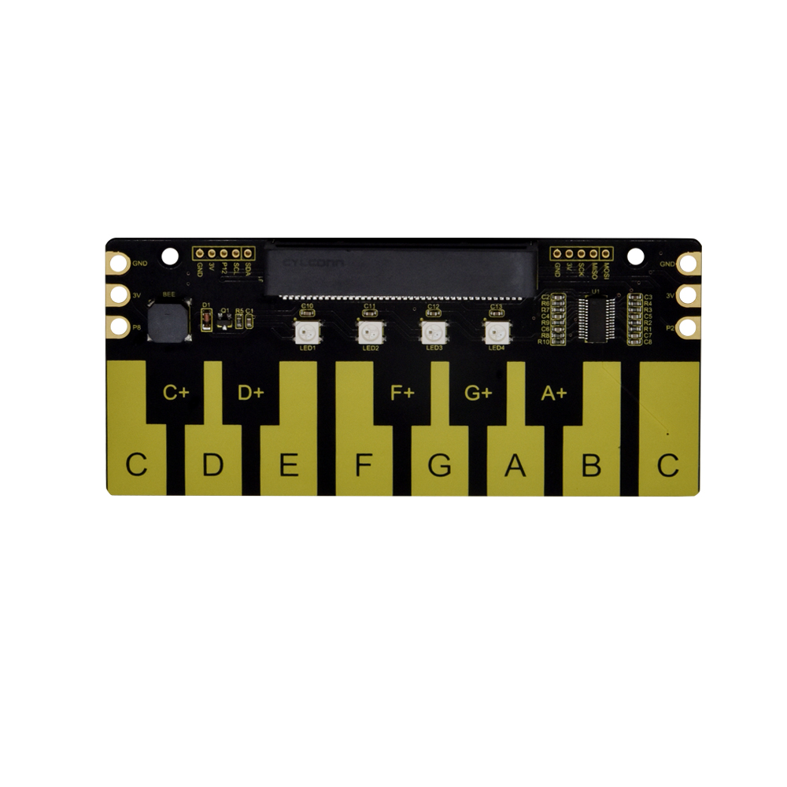
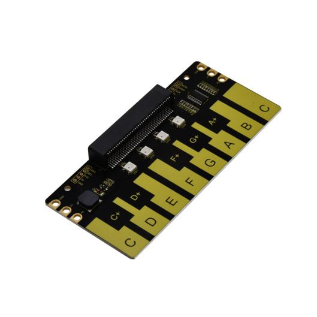
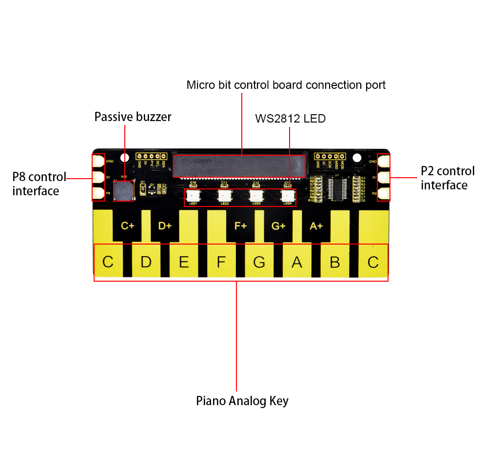
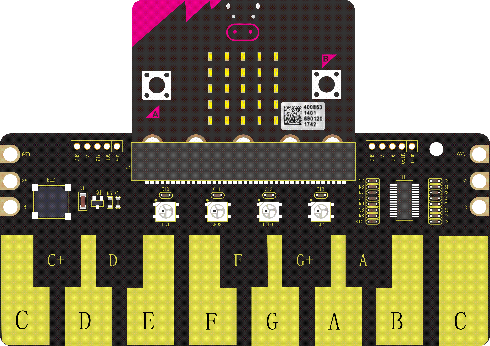
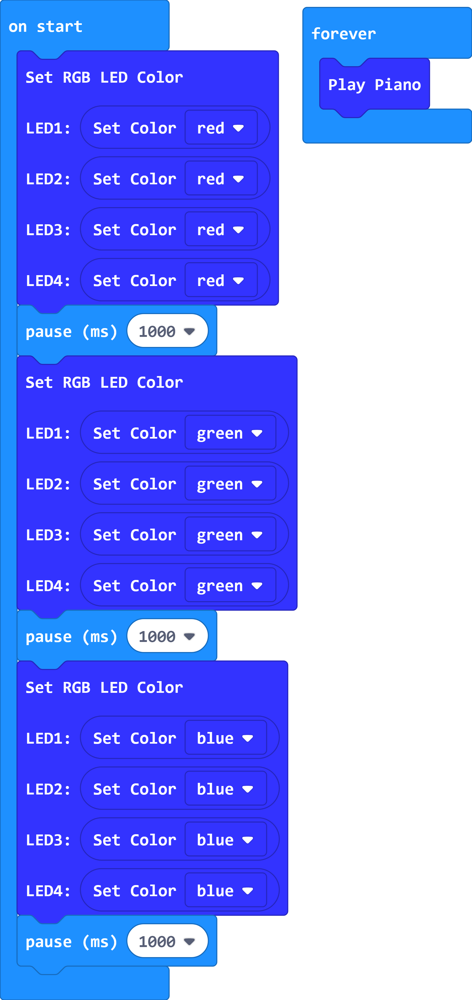
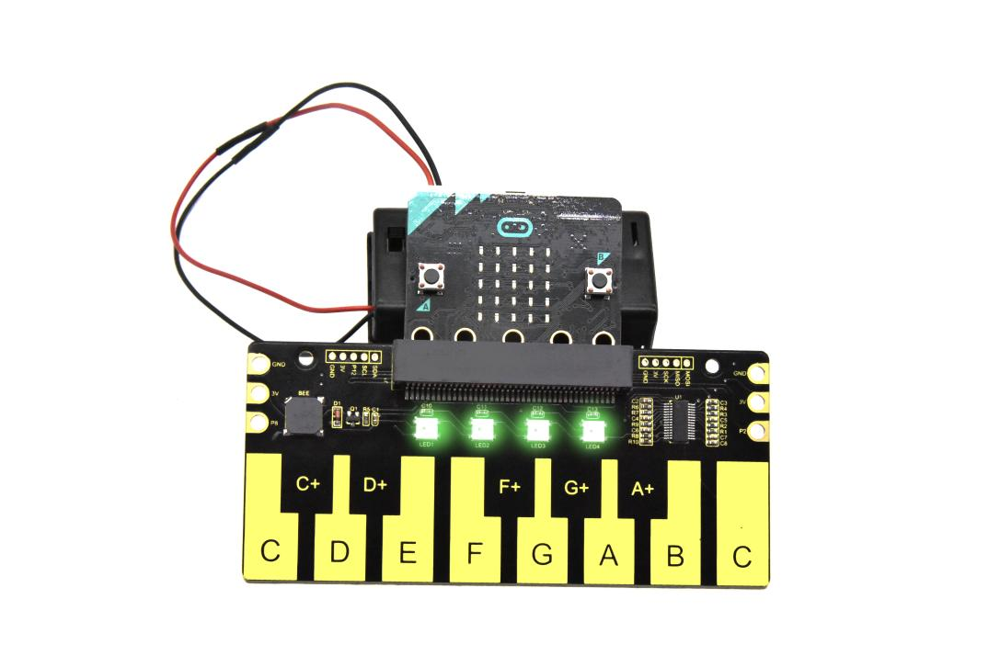
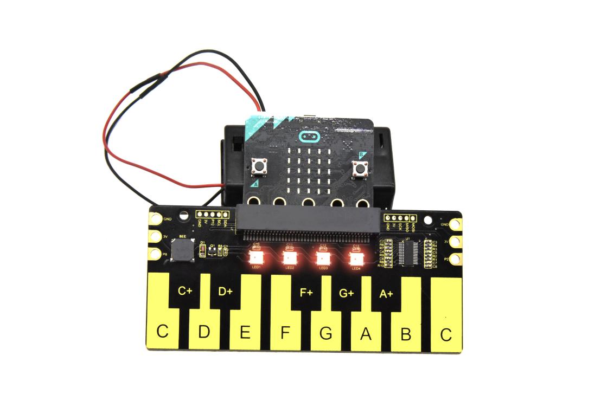
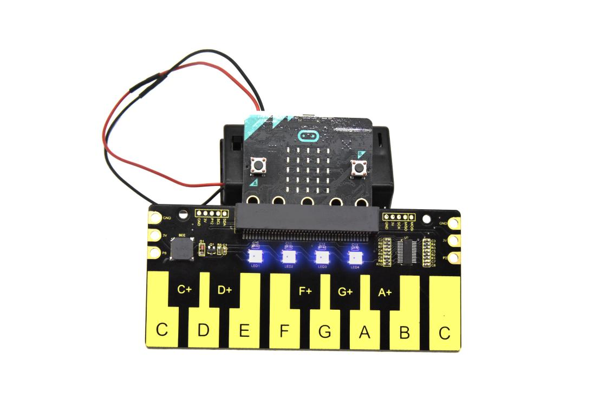
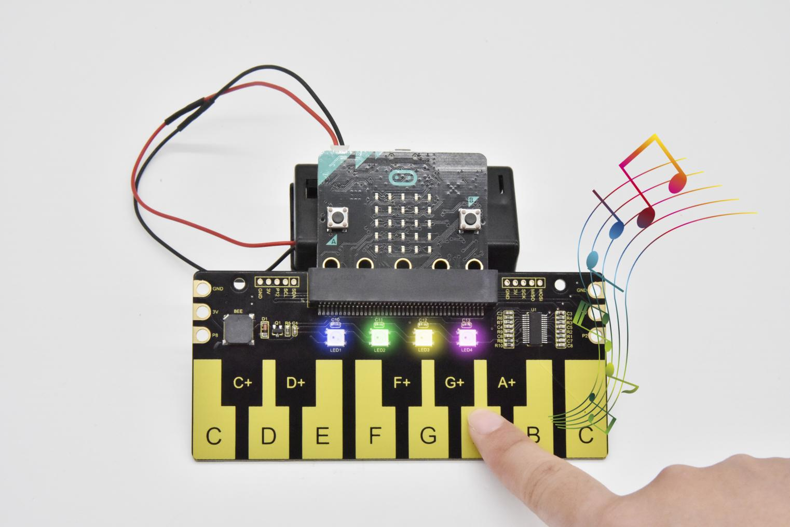

# **Keyestudio Piano Shield for Micro:bit**

## Overview

Keyestudio micro:bit piano shield is fully compatible with micro:bit boards.
This shield integrates the TTP229-LSF chip, 8 touch piano keys, 4 WS2812 LEDS
and a passive buzzer element.

It can display different colors and emit different sounds.

It also comes with 6 edge connectors, containing two 3V power input/output
connectors, 2 signal connectors. Besides, it extends 2 rows of header pad
interfaces, easy for soldering the pin headers/female headers of 2.54mm pitch.
One row contains 3V power input/output and SPI communication; the other contains
3V power input/output, signal pin and I2C communication.

The shield has two 3.2mm fixed holes, convenient for mounting on other devices.

# Technical Details

-   Power supply from:

1.  Micro:bit main board: Micro USB port (5V); external power jack 3.3V

2.  Piano shield: edge connectors (3V); header pad interface (3V)

-   Control chip: TTP229-LSF

-   Dimensions: 124mm\*55mm\*10mm

-   Weight: 29.9g

# PINOUTS

# Hookup Guide

Insert firmly the micro:bit main board into the keyestudio piano shield.

# Source Code

Copy the hex file code to your micro:bit just like copying a file to a USB
drive. You can right click and choose "Send To→MICROBIT."

# Result

Send the code to micro:bit, the 4 WS2812 LEDS on the piano shield turn on red
for 1 second, green for 1 second, blue for 1 second.

When you touch the different piano keys, buzzer will make a tone, and the 4
WS2812 LEDS show shiny colors.

Resource

[https://fs.keyestudio.com/KS0440](https://fs.keyestudio.com/KS0445)
