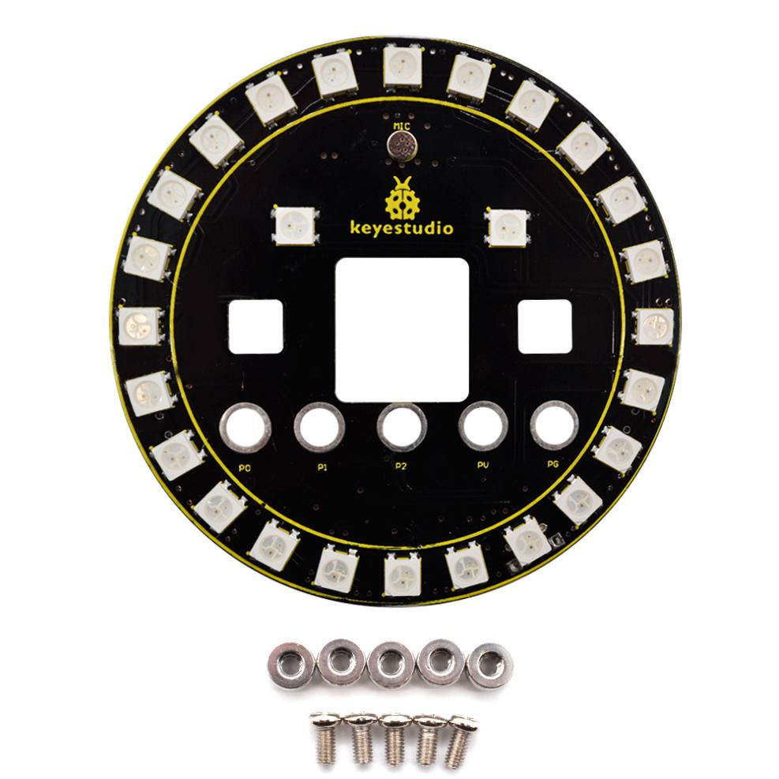
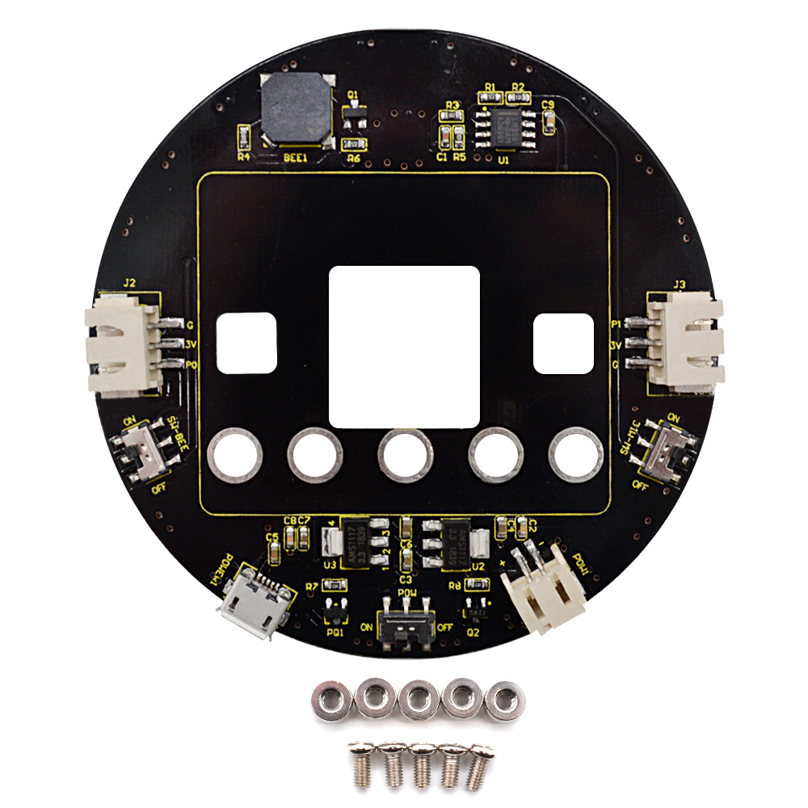
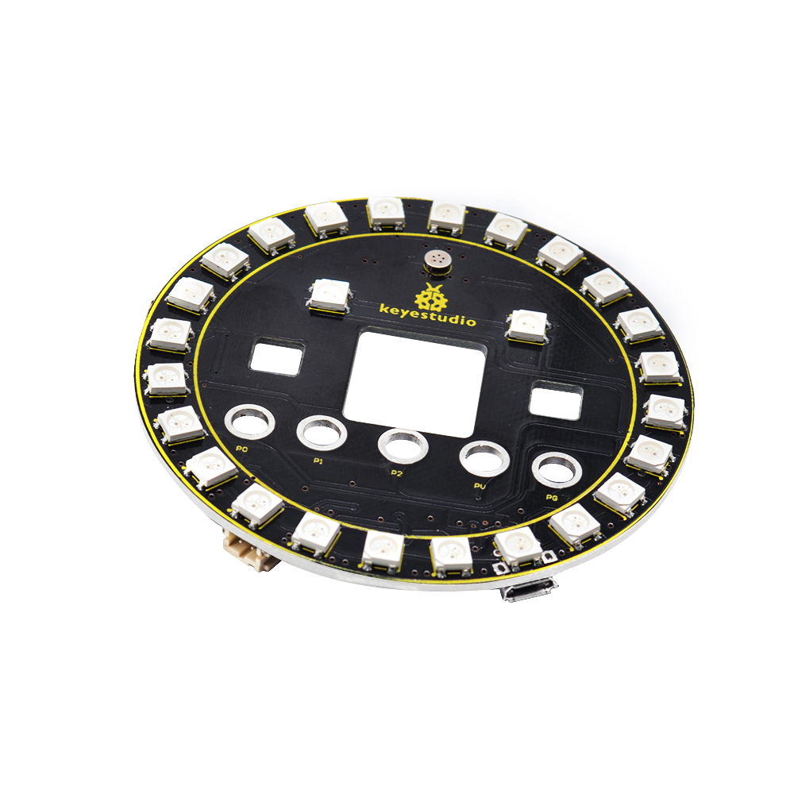
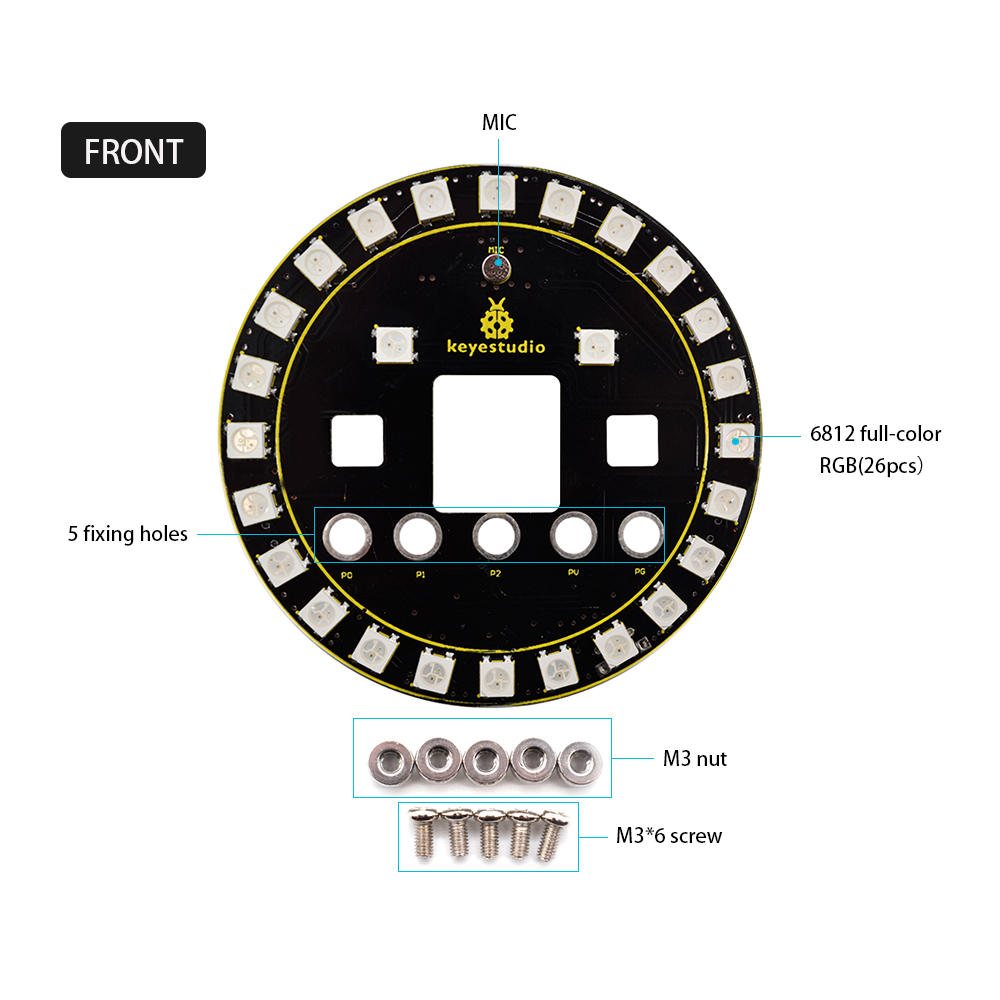
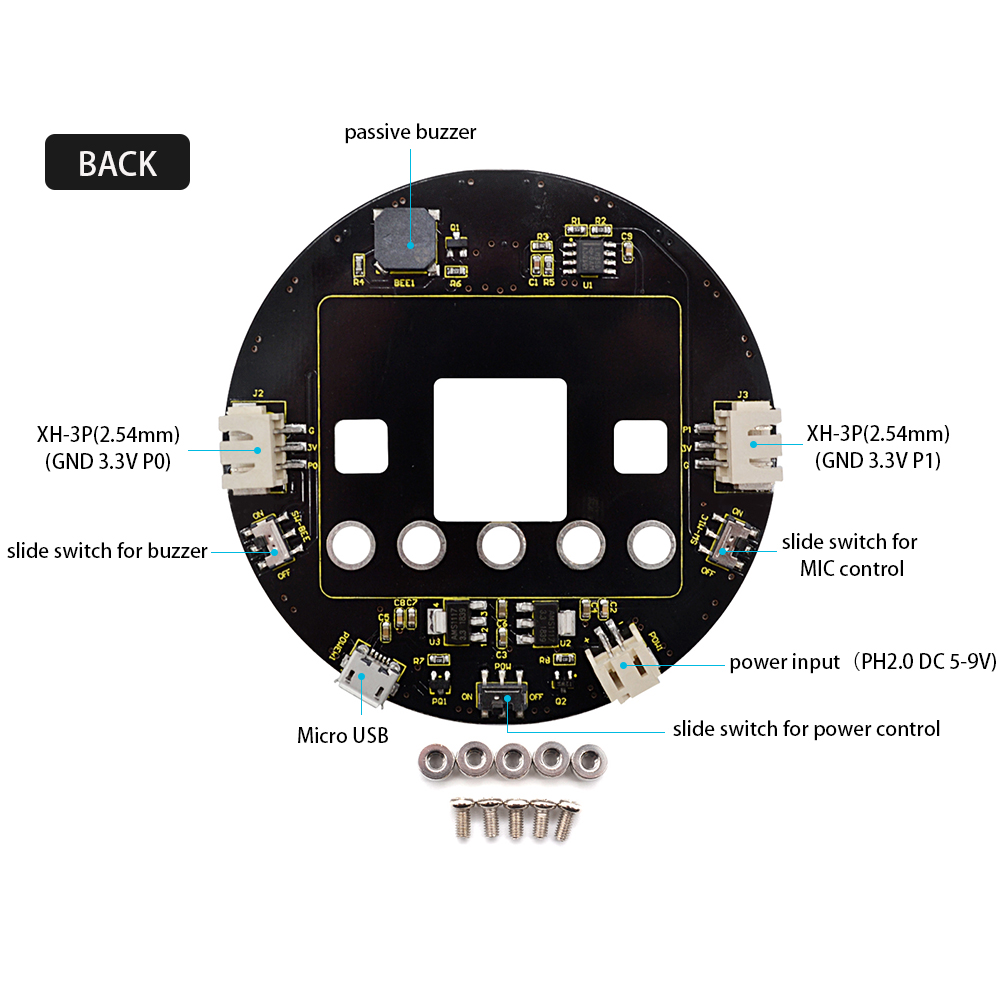
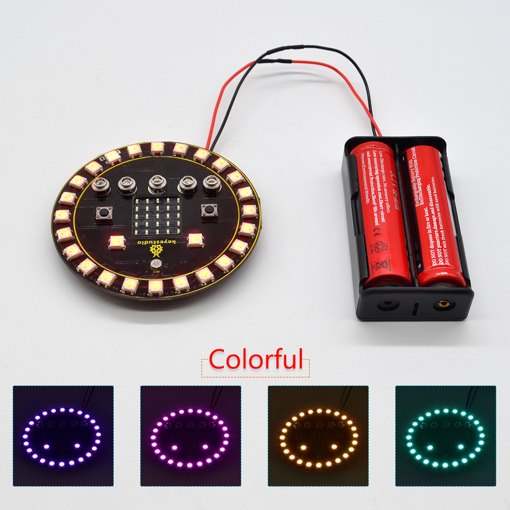
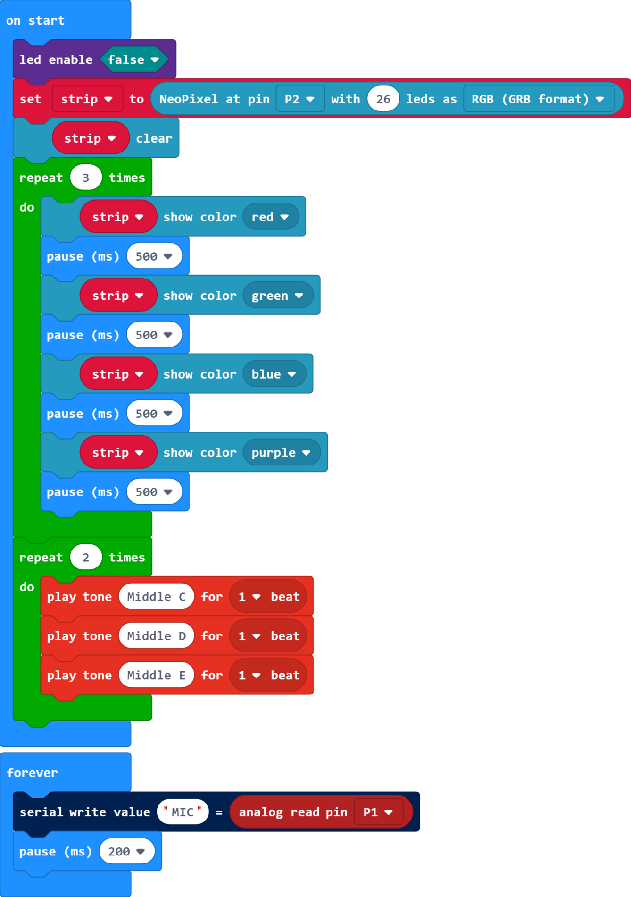
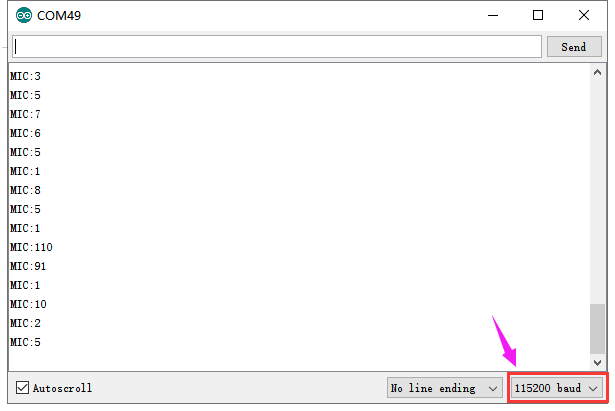

# **Keyestudio SK6812 Full-color RBGW LED Ring Shield for Micro:bit**

# Overview

Keyestudio SK6812 Full-color RBGW LED Ring Shield is fully compatible for
Micro:bit development board. It integrates 26 SK6812 Full-color RBGW LEDS, a
microphone and a passive buzzer.

The RGB ring shield is super cool; and comes with 5 M3 fixing holes (wiring
terminal), so easy to mount or connect the micro:bit main board to the shield
using included 5 screws and 5 nuts.

For power supply, you can use built-in micro USB port or PH2.0-2P connector (DC
5-9V). The shield comes with a slide switch for power control.

The shield’s P0 is for passive buzzer control, which depends on a slide switch.
When turn the slide switch to OFF position, passive buzzer is available; turn to
ON position, the P0 can access to external devices via XH-3P socket.

The P1 is connected to microphone, also depending on a slide switch. When turn
the slide switch to OFF position, MIC is available; turn to ON position, the P1
can access to external devices via XH-3P socket.

# Technical Details

-   Voltage input: DC 5-9V

-   Operating voltage: DC 3.3V

-   Operating current: 350mA

-   Maximum power: 1.5W

-   Operating temperature range: -20℃～+75℃

-   Dimensions: diameter 80mm

-   Weight: 26g

-   Environmental properties: ROHS

-   Comes with 5 M3 nuts, 5 M3\*6 screws

# PINOUTS

# Connection

Tighten the micro:bit main board to the RGB shield using 5 screws and 5 nuts.

# Source Code

Connect the SK6812 Full-color RBGW LED Ring Shield for micro:bit to the computer
using a micro USB cable. **  
**Copy the hex file to your micro:bit just like copying a file to a USB drive.

On package find the microbit-KS0444 file, you can right click and choose "Send
To→MICROBIT."

****

# Test Result

Done uploading the code, turn the slide switch for power to ON position; turn
slide switch for passive buzzer to OFF position, and slide switch for MIC to ON
position.

The 26 pcs RBGW LEDs on the shield will circularly turn on red, green, blue and
purple three times. The passive buzzer makes a beat KS0444/mediant C, KS0444/mediant D,
KS0444/mediant E twice, for loop.

Open the serial monitor and set the baud rate to 115200, the monitor window will
print out the analog value of sound measured by MIC.

The louder the sound, the larger the analog value. As shown below.

Resource

<https://fs.keyestudio.com/KS0444>
