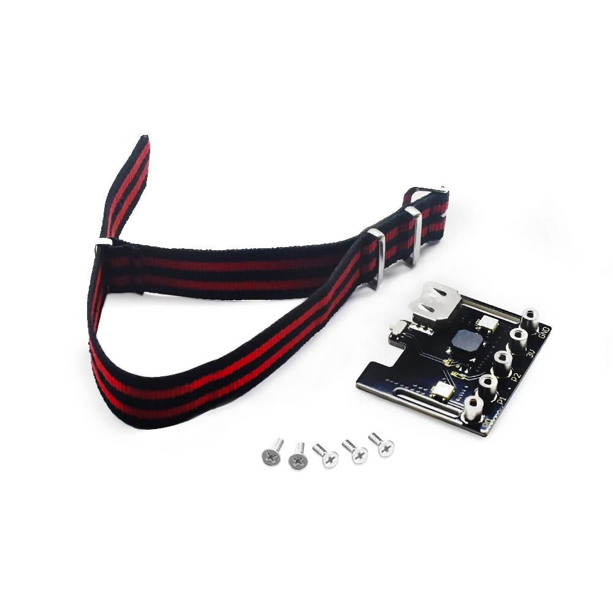
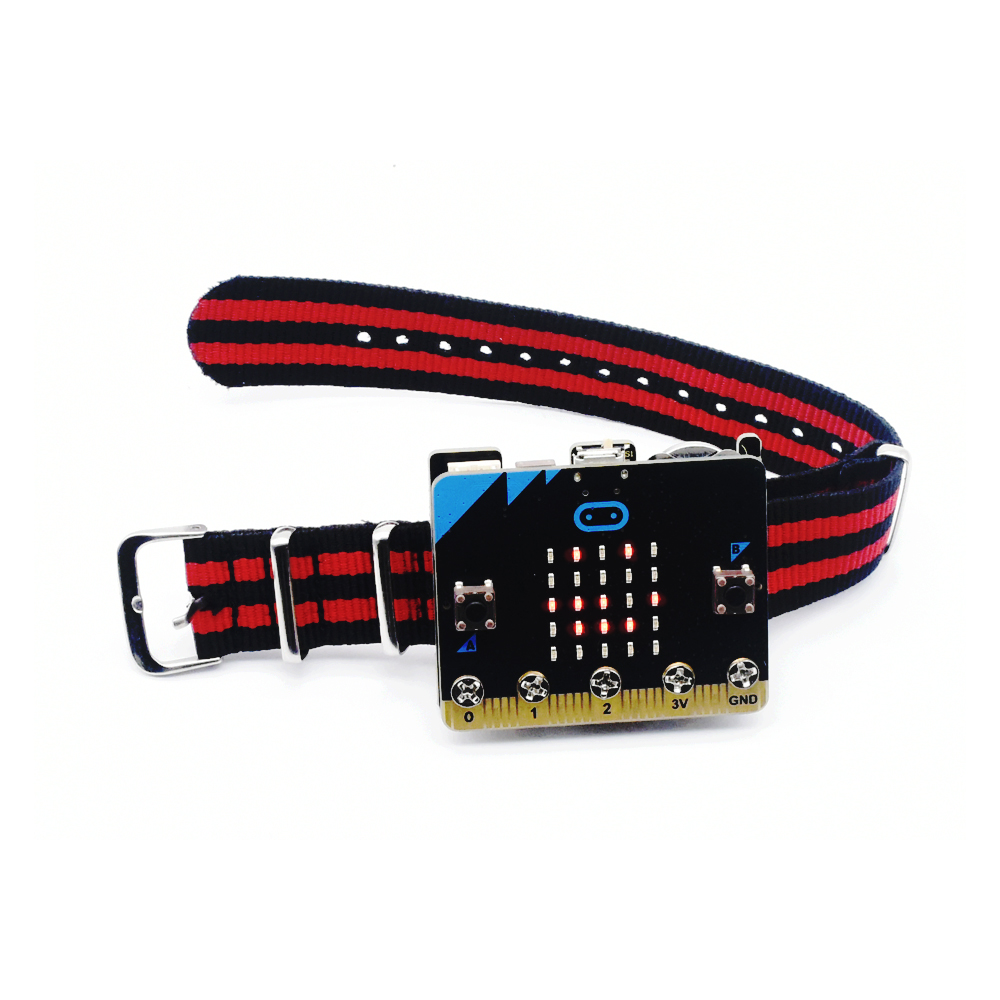
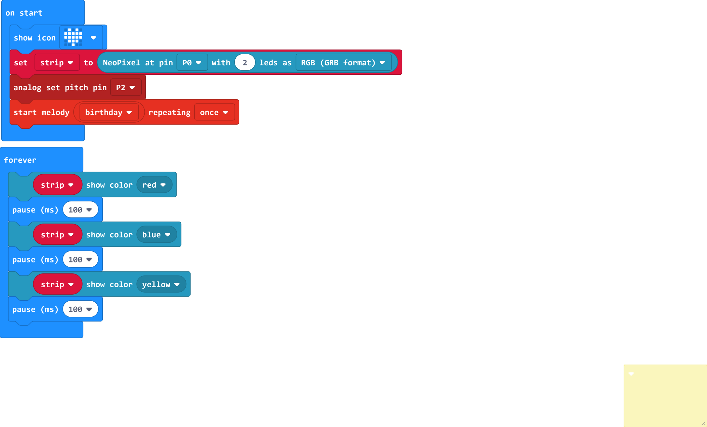

# **Keyestudio Micro bit Power Shield**

**1.Description**

The keyestudio micro bit power shield is fully compatible with micro bit control
board. It can provide power for control board. And it is easy to fix the control
board on the shield with 5 M3\*6MM flat screws. What’s more, a 20mm watchband
can help carry this shield on the wrist. It comes with 2 SK6812 LED to display
various colors, a passive buzzer to play all kinds of music, as well as a CR1632
button battery slot and a dial switch to supply power.

Note: button battery is not included(CR1632 button battery), but you could
purchase it on Ebay or Amazon.

**2.Parameters**

Working voltage: DC 3.3V  
Working current: 30mA  
Maximum power: 150mA  
Working temperature: -20 ℃ --60 ℃  
Size: 51.7mm \* 42.5mm  
Environmental attributes: ROHS

**3.Connection Diagram**

**4.Test Code**

**5.Test Results**

Upload the code successfully, and then install a CR1632 on the shield according
to connection method. Dialing the DIP switch to the ON end, the LED dot matrix
of the micro bit control board displays a heart-shaped pattern. Furthermore, the
passive buzzer plays the happy birthday song once, and the two SK6812 LEDs
display red, green, and yellow alternately.

**Resource**

https://fs.keyestudio.com/KS0482

