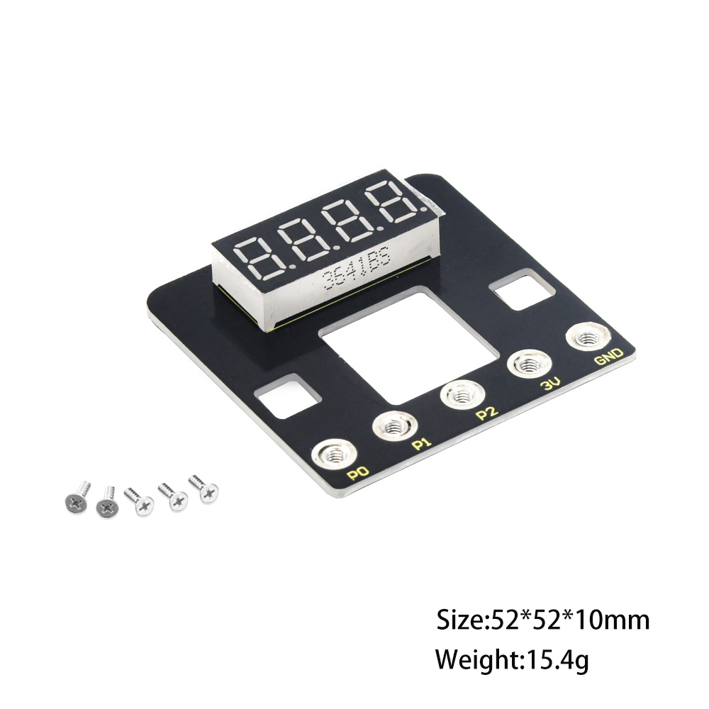
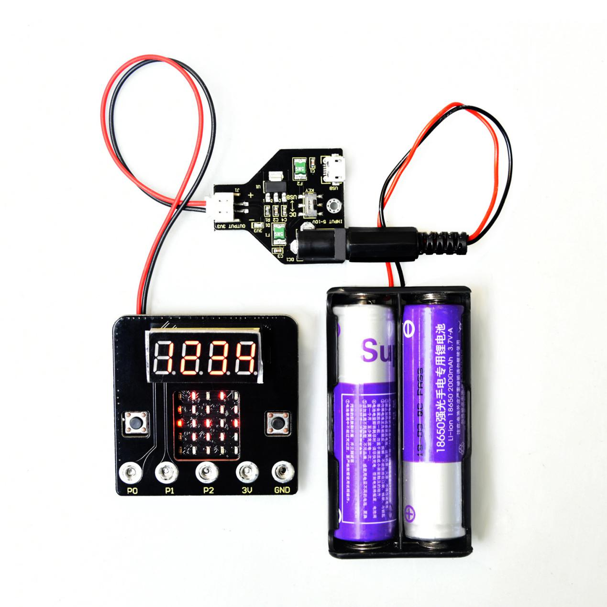
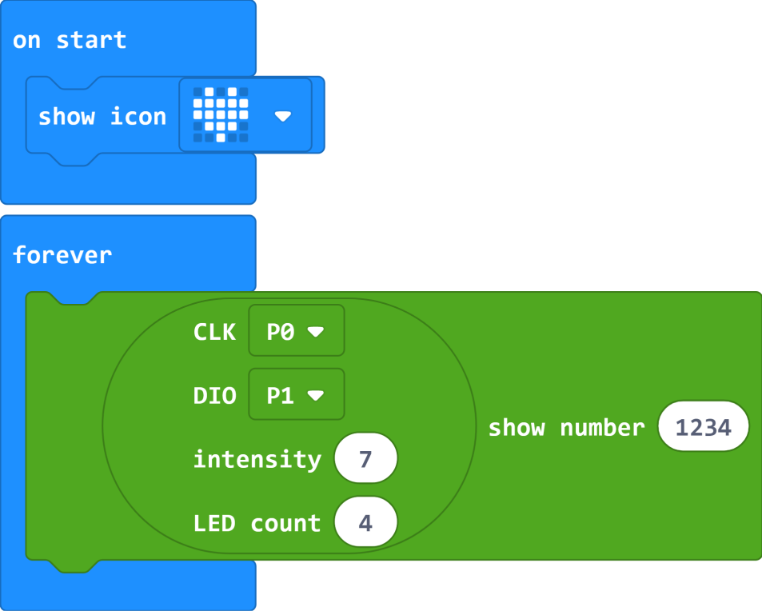
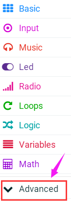
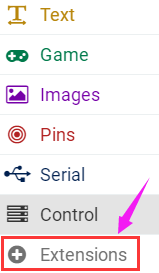
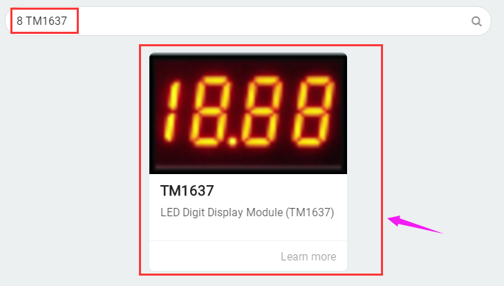
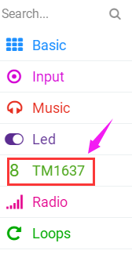

# **Keyestudio Micro bit 4-Digit Tube Shield**

**(Black and Eco-friendly)**

**1.Description**

When we conduct experiments with micro bit board, it is inconvenient to show the
corresponding data with its LED dot matrix. Therefore, we have designed this
keyestudio micro bit 4-digit tube shield to highly enhance the digital display
function.The four-digit tube module is a 3.6 inches common anode digital tube,
and the display color is red.

This shield mainly drives the TM1637 chip through the micro: bit board to
control the 4-bit common anode digital tube. P0 is connected to CLK, and P1 goes
to DIO. The micro bit control board is easily fixed on the shield with 5 M3\*6MM
flat screws if you use it.

**2.Parameters**

Working voltage: DC 3.3V  
Working current: 50mA  
Maximum power: 200mA  
Working temperature: -20 ℃ --60 ℃  
Size: 52 \* 52 \* 10mm  
Weight: 15.4g  
Environmental attributes: ROHS

**3.Connection Diagram**

**4.Test Code**

**Attention: Need to add library file when setting code, firstly click**

**，then
tapto search 8 TM1637，click
TM1637 icon，as shown below:**

Install the library file successfully, click the **8 TM1637** to set the
corresponding test program.

**Test Code**

Upload the code successfully, and wire according to connection diagram (power is
supplied to the micro: bit control board, and the power supply method can be
freely selected). After power-on, the LED dot matrix on the micro: bit control
board displays a heart-shaped pattern, and a 4-digit digital tube displays
number “1234”

**5.Resource:**

https://fs.keyestudio.com/KS0483

