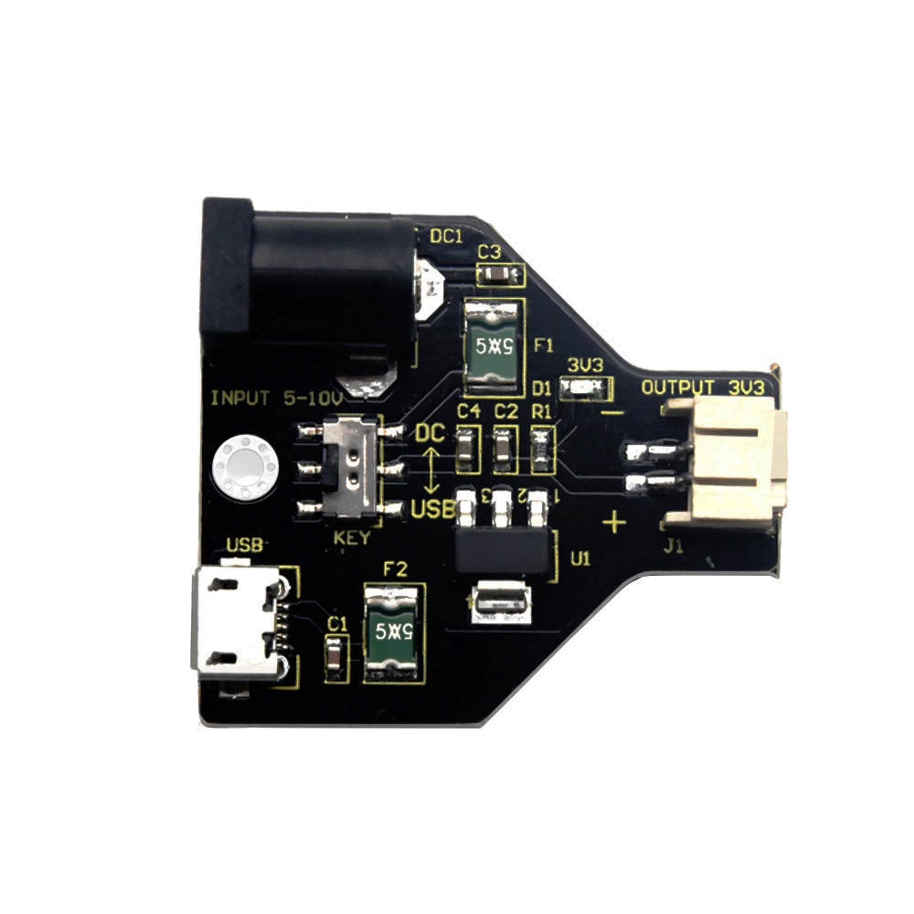

# **Keyestudio Micro bit Power Adapter Board**

1.  **Description**

We particularly design this power adapter board compatible with micro：bit
control board on the condition that no proper power supply is around.

The adapter board can supply power by the black DC port or USB. The DIP switch
of the adapter board needs to be dialed to the DC terminal when supplying DC
5-10V by DC port while the DIP switch needs to be dialed to the USB end, when
providing power by USB.

After powering it up, its output terminal (2mm gray-white interface) gives out
DC 3.3V to power a micro: bit control board.

1.  **Parameters**

DC input voltage: DC 5-10V  
Output voltage: DC 3.3V  
Output current: 1A  
Maximum power: 3W  
Working temperature: -20 ℃ --60 ℃  
Size: 37.5 \* 33.4mm  
Environmental attributes: ROHS
