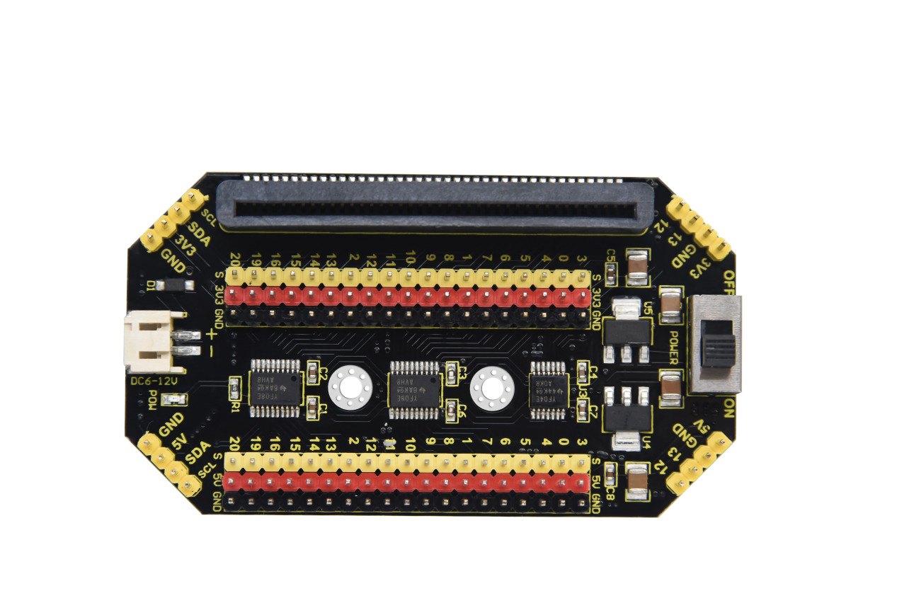
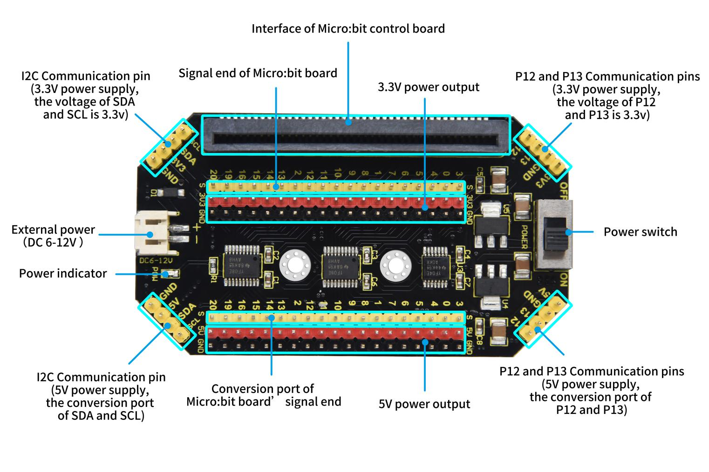
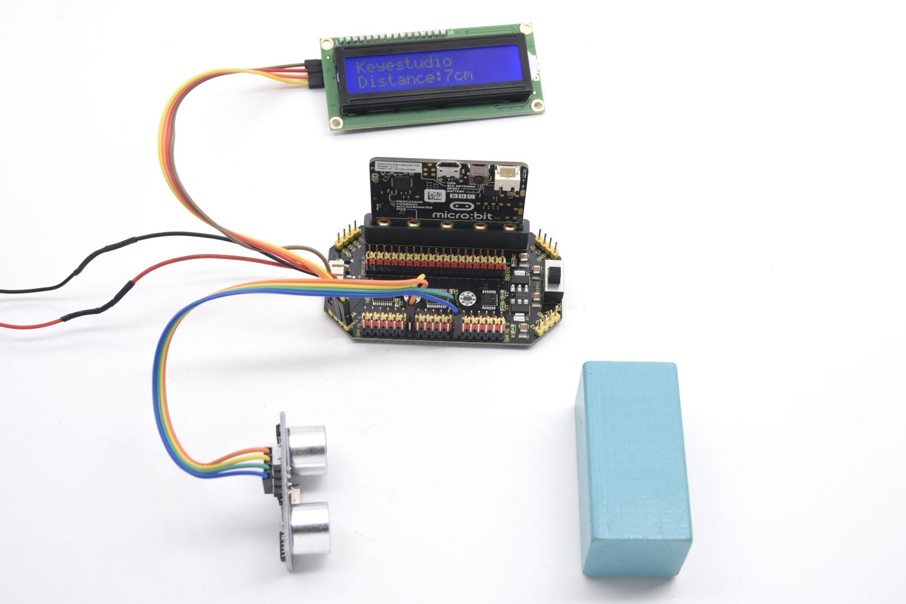

# **Keyestudio Micro bit Expansion Board with IO Ports**

**Black and Eco-friendly**

****

**Description**

The BBC micro:bit is a starter board for teenager programming designed by the
BBC. It supports the PXT graphical programming interface developed by Microsoft
and can be used under Windows, MacOS, IOS, Android and many other operating
systems.

This expansion board can be connected to external power(DC 6-12V

, PH2.0-2P interface), with a DIP switch for controlling power.

There are two groups of 4P pins extended for I2C communication interface(3.3V
and 5v power supply), and another two sets of 4p pins extended for P12 and
P13(3.3V and 5v power supply).

At same time, this board comes with 2 groups of IO interfaces connected to micro
bit control board.

The signal end close to 3.3V power output is 3.3V and linked with signal
terminal of micro:bit board.

The signal terminal close to 5V power end is the conversion port of micro:bit
board

When we set signal end to digital output(HIGH level), the signal terminal (close
to 5V power end) is 5V.

When we set signal terminal to analog output（P0 P1 P2 P3 P4 P10）, the signal
end(close to 5V power end) is 5V\*analog value/1023.

While signal end is set to analog input and the voltage of signal end is 3.3-5V,
the corresponding signal end of micro:bit is 3.3V;

While its voltage is 0-3.3V, the voltage of signal terminal and signal end of
micro bit is same.

When the signal end(close to 5V) is set to digital input and its voltage is
2.1-5V, the corresponding signal end is high level.

**Specification:**

Input voltage: DC6-12V  
Power input port: PH2.0-2P interface  
Wiring port: pitch 2.54mm pin header

**Interface Description**

# 
