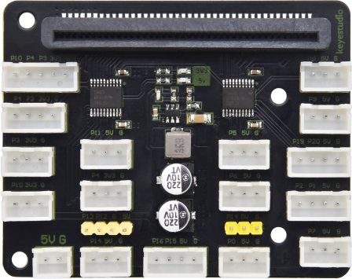
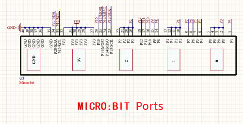
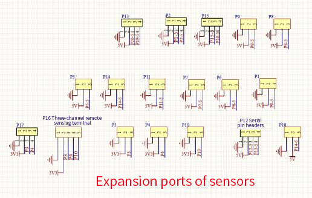
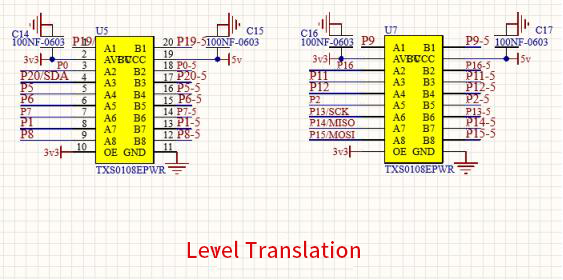
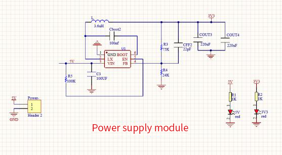
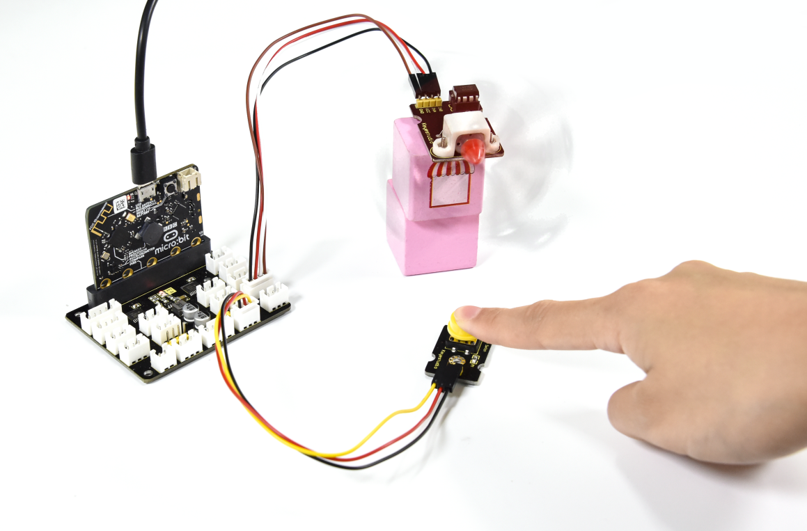
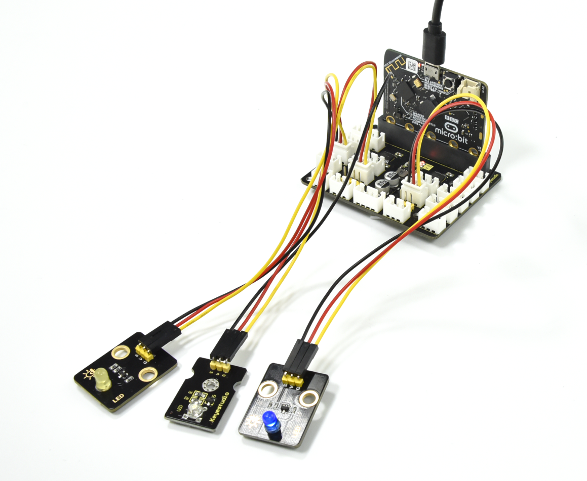
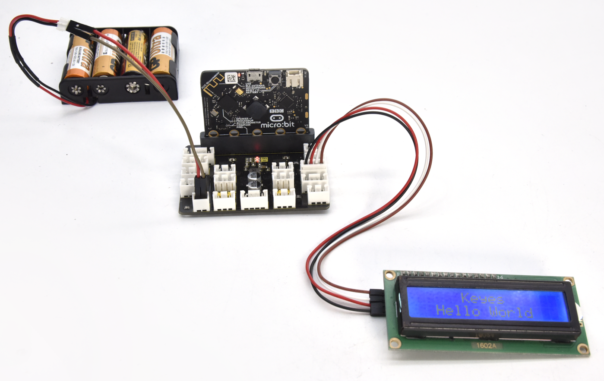

# Keyestudio Micro:bit Expansion Board

1.  **Description**

When we are doing DIY experiments, we often use the Micro:bit control boards and
sensor u[. In order to facilitate the wiring-up, the Micro:bit expansion board
are led out the pins for the connection of control board, motors and sensors.
Due to anti-reverse interfaces and the fixed wire sequence, the sensor/module
won’t burn out.

The expansion board has 2.54mm anti-reverse interfaces with silk screen. We
supply power through the on-board PH2.54 lithium battery box and an micro USB
cable. The power supply voltage is 3.3\~5V.

In addition, it comes with four 3mm positioning holes, which is convenient to
fix on other devices.

1.  **Specification**

Working voltage: 3.3V\~5V

Current: 500mA

Maximum power: 2.5W

Weight: 25.1g

Operating temperature range: 0\~50°C

Interface: 2.54mm anti-reverse interface

Size: 70.2\*56\*1.6mm

Hole diameter: 3mm

1.  **Schematic Diagram**

## 4. Pin out

## 5. Test Results

# 
