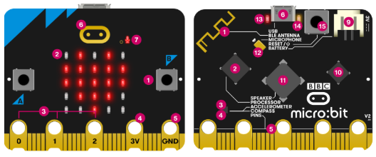
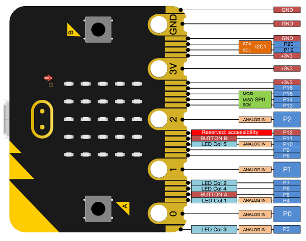
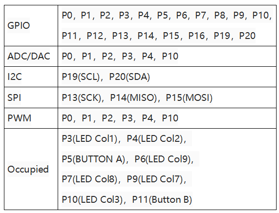

# Introduction

## Description

The BBC micro:bit is a microcontroller board designed by the BBC specifically for programming education among young people. It is easy, effective, and engaging, with simple and convenient programming. It supports multi-platform development via web browsers, offline desktop software, Android phones, iPhones, and tablets. The official block-based editor is Microsoft MakeCode, and our text-based programming tool is the micro:bit Python editor. The BBC micro:bit also works with Scratch, Code.org App Lab, and a wide range of other tools/editors.

## Specification

- Working voltage: 3.3V
- Power supply voltage: 3-3.3V
- Micro USB program burning/power supply port: 5V
- PH2.0 power interface: 3-3.3V
- Alligator clip interface: 3-3.3V
- Detection range: 0-3.3V
- Processor: Arm Cortex-M4 32 bit processor with FPU
- Working temperature: 0-85℃
- Micro USB program burning/power supply port
- PH2.0 3V power supply port
- 4mm alligator clip interface*5
- Gold finger interface*20
- Product size: 43*52mm
- Weight: 9.6g

## Features

- Support PXT graphical programming interface developed by Microsoft
- Support Windows, macos, iOS and Android system
- The programming environment is based on WEB services, no need to download additional compilers
- Burn and simulate program via USB on PC terminal
- Burn and simulate program via Bluetooth
- Support multiple communication programming languages including javasript, python, mbed c.

## micro:bit V2

|  #   |            Name            |                         Description                          |
| :--: | :------------------------: | :----------------------------------------------------------: |
|  1   |          Buttons           | The micro:bit has two buttons on the front that can be used separately or together to make things happen. |
|  2   | LED display & light sensor | 25 LEDs arranged in a 5x5 grid make up the display for showing pictures, words and numbers. They can also act as sensors, measuring how much light is falling on your micro:bit. |
|  3   |         Pins-GPIO          | The GPIO pins allow you to connect headphones, sense touch and add other electronics to expand the possibilities of your micro:bit. The new micro:bit has indentations to grip crocodile clips more securely. |
|  4   |      Pin-3 volt power      | You can power external LEDs and other electronics using the 3 volt power pin. |
|  5   |         Pin-Ground         | The GND pin is the ground or Earth pin - it's used to complete electrical circuits when you connect headphones, LEDs or external switches to your micro:bit. |
|  6   |      Touch logo - new      | The new micro:bit has an extra input. The gold logo also works as a touch sensor. You can use it as an extra button in your programs, in addition to the A and B buttons. |
|  7   |     Microphone LED-new     | You can create programs that react to loud and quiet sounds and measure noise levels with the new micro:bit's built-in microphone. The microphone LED shows you when the microphone is actively measuring sound levels. Just to the left of the LED, you’ll see a small hole where the sound goes in. |

## Pins Description

