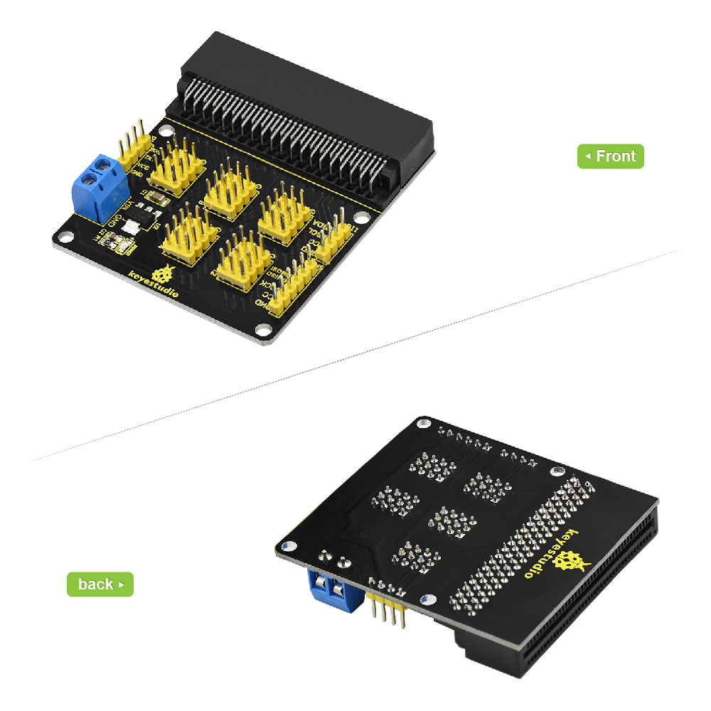
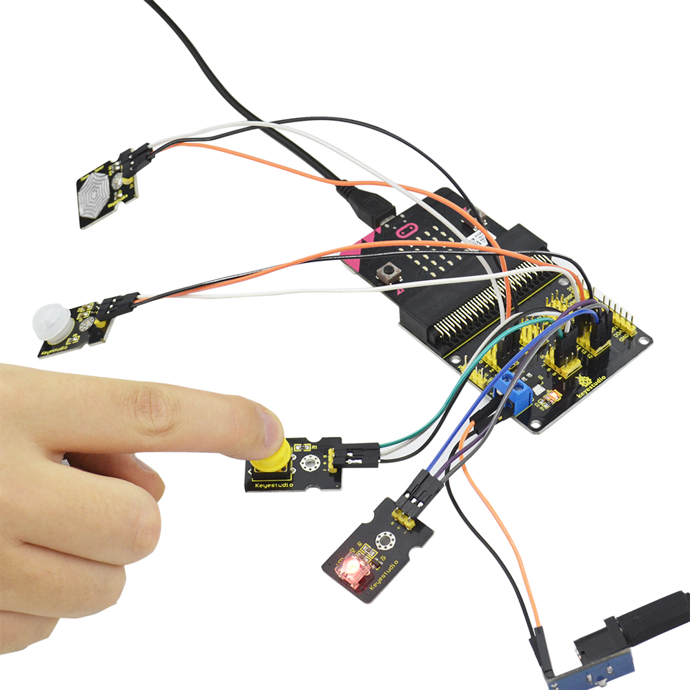

# **Keyestudio Sensor Breakout Board for micro:bit**

**(Black& Environmental-friendly)**

****

**Introduction**

The BBC micro:bit is a powerful handheld, fully programmable, computer designed
by the BBC. It was designed to encourage children to get actively involved in
technical activities, like coding and electronics.

It features a 5x5 LED Matrix, two integrated push buttons, a compass,
Accelerometer, and Bluetooth.

It supports the PXT graphical programming interface developed by Microsoft and
can be used under Windows, MacOS, IOS, Android and many other operating systems
without downloading the compiler.

Looking to do more with your BBC micro:bit? Unlock its potential with this
sensor breakout board for the BBC micro:bit!

We specially design this sensor breakout board to make simple connection with
the micro:bit main board. It comes with AMS1117 chip. You can connect the
external DC4.75-12V to power for micro:bit development board.

This board not only breaks out all the digital and analog interface in the form
of servo line sequence, but also adds I2C、serial port and SPI communication
interfaces, very easy for sensor connection.

**Parameters**

-   Input Voltage: DC 4.75-12V

**Application**

You are able to connect external circuit to design your own projects. For
instance, connect the button module and other module to control the LED module
stay on or off.

